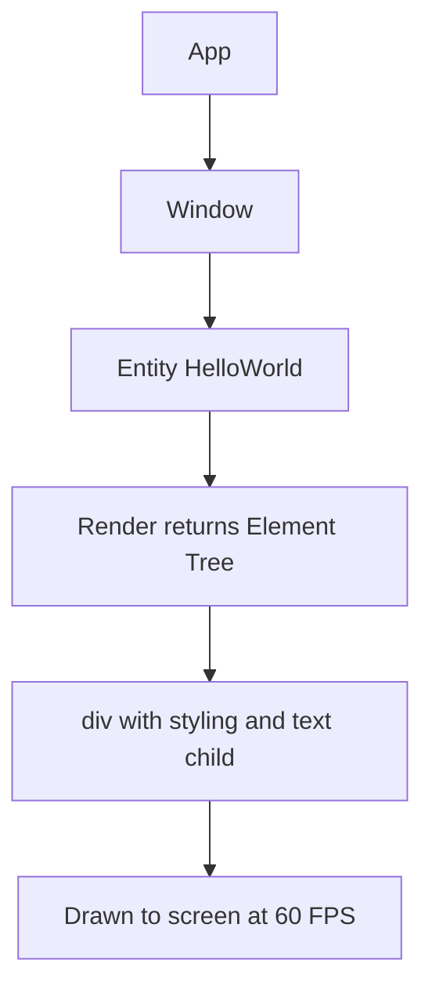

# Part 1: Your First GPUI Application

Let's build something you can see on screen in the next five minutes. We'll worry about why it works afterward.

## The Code

Create a new file called `hello.rs` somewhere you can run it:

```rust
use gpui::*;

struct HelloWorld {
    count: usize,
}

impl Render for HelloWorld {
    fn render(&mut self, _window: &mut Window, _cx: &mut Context<Self>) -> impl IntoElement {
        div()
            .flex()
            .bg(rgb(0x1e1e1e))
            .size_full()
            .items_center()
            .justify_center()
            .text_xl()
            .text_color(rgb(0xffffff))
            .child(format!("Clicked {} times", self.count))
    }
}

fn main() {
    App::new().run(|cx: &mut App| {
        cx.open_window(WindowOptions::default(), |window, cx| {
            cx.new(|_cx| HelloWorld { count: 0 })
        })
        .unwrap();
    });
}
```

To run it, you'll need to set up a Cargo project that depends on GPUI. The details of Rust's build system matter, but not yet. For now, copy one of the examples in `crates/gpui/examples/` and modify its `Cargo.toml` to point to your file.

## What Just Happened?

You created a window that displays text. If you squint, it looks like this:



Let's break down each piece of the code, starting from what you already know.

## Python Parallel: The Class

```python
class HelloWorld:
    def __init__(self):
        self.count = 0
```

In Rust, you write it like this:

```rust
struct HelloWorld {
    count: usize,
}
```

Three differences:

1. **`struct` instead of `class`**: Rust separates data (structs) from behavior (implementations). This is not a philosophical stance; it's how the language works.

2. **Types everywhere**: `count: usize` means "count is an unsigned integer of pointer size." In Python, you'd just write `self.count = 0` and the type would be inferred at runtime. Rust requires you to declare types at compile time. `usize` is Rust's version of Python's `int`, but it can't be negative. If you try to assign `-1` to a `usize`, the compiler will tell you to reconsider your life choices.

3. **No constructor here**: Rust doesn't have `__init__`. You'll create instances directly later with `HelloWorld { count: 0 }`. Think of it like Python's `dict` literals, but typed.

## The Render Trait

```rust
impl Render for HelloWorld {
    fn render(&mut self, _window: &mut Window, _cx: &mut Context<Self>) -> impl IntoElement {
        // ...
    }
}
```

This says: "HelloWorld implements the Render trait." A trait is like a Python protocol or interface. If your struct implements `Render`, GPUI knows how to draw it.

The method signature is dense. Let's unpack it:

```rust
fn render(&mut self, _window: &mut Window, _cx: &mut Context<Self>) -> impl IntoElement
```

### `&mut self`

In Python, every method gets `self` as the first argument. In Rust, you have three options:

- `&self`: Borrow the struct immutably (read-only)
- `&mut self`: Borrow the struct mutably (read-write)
- `self`: Take ownership (consume the struct)

The `&` means "reference" or "borrow." We'll get to ownership properly in Part 2, but for now: `&mut self` means "let me modify this struct temporarily, but I'll give it back."

In Python terms, it's like the difference between:

```python
def read_something(self):
    return self.count  # Just reading

def modify_something(self):
    self.count += 1  # Modifying
```

Except Rust enforces this at compile time. If you declare `&self` and try to modify `self.count`, the compiler will reject your code. This is not Rust being difficult; it's Rust preventing you from having data races. More on that later.

### `_window: &mut Window` and `_cx: &mut Context<Self>`

The underscore prefix means "I'm not using this variable, but I have to accept it because the trait requires it." If you leave out the underscore, the compiler will warn you about unused variables. Rust is aggressively helpful like that.

In Python, you might write:

```python
def render(self, window, cx):
    pass  # Ignore them
```

But Python won't complain if you don't use `window` or `cx`. Rust will, unless you acknowledge it with `_`.

We'll use these parameters later when we need to interact with the window or the app context. For now, ignore them.

### `-> impl IntoElement`

This return type reads as "returns something that implements the `IntoElement` trait." In other words, "I'll give you back something that can be turned into a UI element."

Why not just say "returns an `Element`"? Because Rust's type system is both extremely precise and occasionally annoying. The actual type returned here is a `Div` with various style methods applied, which is too complex to name. `impl IntoElement` lets you say "it's something that can become an element" without specifying exactly what.

Think of it like Python's duck typing, except enforced at compile time.

## The Element Tree

```rust
div()
    .flex()
    .bg(rgb(0x1e1e1e))
    .size_full()
    .items_center()
    .justify_center()
    .text_xl()
    .text_color(rgb(0xffffff))
    .child(format!("Clicked {} times", self.count))
```

This is the fun part. You're building a tree of UI elements using a fluent API. If you've used Tailwind CSS, this will feel familiar. If you've used SwiftUI or Jetpack Compose, even more so.

Each method call returns `self`, allowing you to chain calls:

```rust
div()           // Create a div element
    .flex()     // Make it a flex container
    .bg(...)    // Set background color
    .child(...) // Add a child element
```

In Python, you might see something similar with method chaining:

```python
(Div()
    .flex()
    .bg(Color(0x1e1e1e))
    .size_full()
    .child(f"Clicked {self.count} times"))
```

Rust's syntax is nearly identical, but there's a key difference: Rust is moving values through the chain. Each method takes ownership of `self` and returns a new (or modified) `self`. Python would typically modify the object in place and return `self` for chaining. Rust's approach enables better compiler optimizations and makes it clearer what's happening.

The last call, `.child(...)`, adds a child element to the div. `format!` is Rust's equivalent of Python's f-strings:

```python
# Python
f"Clicked {self.count} times"
```

```rust
// Rust
format!("Clicked {} times", self.count)
```

The `{}` is a placeholder, and `self.count` fills it in. You can also use `format!("{count}", count = self.count)` for named placeholders, but positional is more common.

## The Main Function

```rust
fn main() {
    App::new().run(|cx: &mut App| {
        cx.open_window(WindowOptions::default(), |window, cx| {
            cx.new(|_cx| HelloWorld { count: 0 })
        })
        .unwrap();
    });
}
```

This is where Rust's syntax starts to look alien if you're coming from Python. Let's go line by line.

### `App::new().run(...)`

`App` is GPUI's main application struct. `App::new()` creates an instance. `.run(...)` starts the event loop.

The argument to `.run()` is a closure (Rust's term for an anonymous function). In Python:

```python
app = App()
app.run(lambda cx: ...)
```

Rust's closure syntax is:

```rust
|cx: &mut App| { ... }
```

The `|...|` denotes the parameters, and the `{ ... }` is the body. The type annotation `cx: &mut App` is often optional, but I've included it here for clarity.

### `cx.open_window(WindowOptions::default(), |window, cx| { ... })`

This creates a window. `WindowOptions::default()` gives you standard window settings (you can customize size, title, etc., later). The second argument is another closure that sets up the window's content.

### `cx.new(|_cx| HelloWorld { count: 0 })`

This is where you create the `HelloWorld` struct and turn it into an entity. `cx.new()` takes a closure that returns your struct.

In Python, you might write:

```python
def create_hello_world(cx):
    return HelloWorld(count=0)

cx.new(create_hello_world)
```

But in Rust, closures are more common than named functions for these small operations.

### `.unwrap()`

This is Rust's way of saying "this might fail, but I'm confident it won't, so just panic if it does."

`open_window` returns a `Result<WindowHandle, ()>`. A `Result` is Rust's way of handling errors without exceptions. It's either:

- `Ok(value)`: Success
- `Err(error)`: Failure

`.unwrap()` extracts the value from `Ok(value)` or panics if it's `Err`. In Python terms:

```python
# Python with exceptions
try:
    window = cx.open_window(WindowOptions.default(), ...)
except Exception as e:
    raise RuntimeError(f"Failed to open window: {e}")
```

Rust makes error handling explicit. We'll cover this properly in Part 2, but for now: `.unwrap()` is fine in examples and prototypes. In production code, you'd handle the error properly.

## Why So Much Syntax?

You might be wondering why Rust requires so many type annotations, explicit borrows, and ceremony compared to Python. The short answer: memory safety without garbage collection.

Python's runtime manages memory for you. Rust's compiler proves your program won't have memory errors (use-after-free, data races, null pointer dereferences) before it even runs. The trade-off is more syntax.

GPUI leverages this to allow you to build complex UIs without worrying about threading issues, because the compiler proves you can't access UI state from multiple threads simultaneously. When you see `&mut Context<Self>`, you're seeing Rust's way of saying "you have exclusive access to this right now."

We'll explore this in depth in Part 2.

## Run It

If you've set up the Cargo project correctly, run:

```bash
cargo run
```

You'll see a window with "Clicked 0 times" in white text on a dark background. It doesn't do anything yet, because we haven't added event handlers. That's Part 4.

## What You've Learned

1. **Structs** hold data; **traits** define behavior
2. **`&mut self`** means "let me modify this temporarily"
3. **Element trees** are built with fluent APIs (method chaining)
4. **Closures** are anonymous functions with `|args| { body }` syntax
5. **`unwrap()`** extracts values from `Result` or panics
6. **GPUI apps** start with `App::new().run(...)`

## What's Next

In Part 2, we'll make this counter actually count. To do that, you need to understand ownership, borrowing, and why Rust's compiler is so particular about who can modify what. You'll also see why GPUI's entity system exists and how it solves problems that plague traditional GUI frameworks.

For now, bask in the glory of having compiled and run Rust code without segfaulting.
