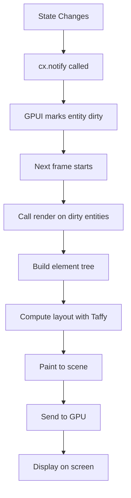

# Part 3: Element Trees and Composition

You've built a counter. Now let's build something more interesting: a todo list. This will teach you how to compose UIs from smaller pieces, handle collections, and structure your code for maintainability.

## The Goal

A todo list with:

- A text input for new items
- A list of todo items
- A button to add items
- Click to toggle completion
- Visual styling to make it not look like a programmer's idea of design

We'll build this incrementally, starting with the parts you already know and introducing new concepts as needed.

## Building Blocks: Element Composition

In GPUI, everything is an element tree. Elements nest inside other elements, like HTML:

```html
<div>
  <h1>Title</h1>
  <p>Paragraph</p>
</div>
```

GPUI's version:

```rust
div()
    .child(h1().child("Title"))
    .child(p().child("Paragraph"))
```

Wait, there's no `h1()` or `p()` in GPUI. That was a lie. GPUI only has a few built-in elements:

- `div()`: The main container (you've seen this)
- `text()`: For styled text
- `img()`: For images
- `canvas()`: For custom drawing
- `svg()`: For SVG rendering
- `list()`: For scrollable lists

Everything else is built by composing these primitives. Semantics (what's a heading vs. a paragraph) come from your styling, not from distinct element types. This is simpler than HTML but requires more discipline.

Let's build our todo list's structure.

## The Data Model

First, define the data:

```rust
struct TodoItem {
    text: String,
    completed: bool,
}

struct TodoList {
    items: Vec<TodoItem>,
    input_text: String,
}
```

In Python:

```python
class TodoItem:
    def __init__(self, text, completed=False):
        self.text = text
        self.completed = completed

class TodoList:
    def __init__(self):
        self.items = []
        self.input_text = ""
```

Rust's version is more verbose, but you get compile-time guarantees that `text` is always a `String` and `completed` is always a `bool`. Python would let you assign `items = "oops"` and blow up at runtime. Rust won't compile.

## Rendering Multiple Elements

To render the list of items, you need to iterate over `self.items` and create an element for each one. GPUI's `div()` has a `.children()` method that takes an iterator:

```rust
impl Render for TodoList {
    fn render(&mut self, _window: &mut Window, cx: &mut Context<Self>) -> impl IntoElement {
        div()
            .flex()
            .flex_col()
            .size_full()
            .gap_2()
            .p_4()
            .children(
                self.items.iter().map(|item| {
                    div()
                        .child(item.text.clone())
                })
            )
    }
}
```

`.children()` takes anything that implements `IntoIterator<Item = impl IntoElement>`. In plain English: give it an iterator of things that can be turned into elements.

Here's what's happening:

1. `self.items.iter()`: Create an iterator over the items (borrows them)
2. `.map(|item| { ... })`: Transform each item into an element
3. `div().child(item.text.clone())`: Create a div containing the text

Notice `item.text.clone()`. Why clone?

Because `item` is a reference (`&TodoItem`), but `child()` wants to take ownership of the string. You could pass `&item.text`, but then you'd be passing a reference to a string inside a struct you're already borrowing. Rust doesn't like that (it's a lifetime issue we'll address later).

Cloning is simple and correct. For small strings, it's cheap. For large strings, you'd use `Arc<String>` or GPUI's `SharedString`.

## Conditional Rendering

Let's add styling to show completed items differently:

```rust
.children(
    self.items.iter().map(|item| {
        div()
            .child(item.text.clone())
            .when(item.completed, |div| {
                div.line_through()
            })
    })
)
```

`.when(condition, |this| { ... })` applies the closure only if `condition` is true. It's equivalent to:

```rust
let mut element = div().child(item.text.clone());
if item.completed {
    element = element.line_through();
}
element
```

But the method chaining version is cleaner.

In Python, you might write:

```python
for item in self.items:
    div = Div().child(item.text)
    if item.completed:
        div = div.line_through()
```

GPUI's `.when()` keeps the fluent style intact.

There's also `.when_some(option, |this, value| { ... })` for `Option` values, which we'll use later.

## Adding Interactivity

Each todo item should toggle when clicked. You know how to handle clicks from Part 2:

```rust
.children(
    self.items.iter().enumerate().map(|(index, item)| {
        div()
            .child(item.text.clone())
            .when(item.completed, |div| div.line_through())
            .on_click(cx.listener(move |this, _event, _window, cx| {
                this.items[index].completed = !this.items[index].completed;
                cx.notify();
            }))
    })
)
```

We use `.enumerate()` to get both the index and the item. Then we move the index into the closure with `move`.

This works, but there's a subtle problem. We're borrowing `cx` in the outer `render` method, then using it again inside the `.map()` closure. Rust will complain:

```
error[E0502]: cannot borrow `cx` as immutable because it is also borrowed as mutable
```

The issue is that `cx.listener` borrows `cx`, and we're inside a closure that was created while `cx` was already borrowed by `render`.

The fix: call `cx.listener` outside the iterator:

```rust
impl Render for TodoList {
    fn render(&mut self, _window: &mut Window, cx: &mut Context<Self>) -> impl IntoElement {
        div()
            .flex()
            .flex_col()
            .children(
                self.items.iter().enumerate().map(|(index, item)| {
                    let on_click = cx.listener(move |this, _event, _window, cx| {
                        this.items[index].completed = !this.items[index].completed;
                        cx.notify();
                    });

                    div()
                        .child(item.text.clone())
                        .when(item.completed, |div| div.line_through())
                        .on_click(on_click)
                })
            )
    }
}
```

Wait, that still won't work. You can't call `cx.listener` inside the `.map()` closure for the same reason.

The solution: collect the items into a `Vec` first, then iterate:

```rust
let items_elements: Vec<_> = self.items
    .iter()
    .enumerate()
    .map(|(index, item)| {
        (index, item.text.clone(), item.completed)
    })
    .collect();

div()
    .flex()
    .flex_col()
    .children(
        items_elements.into_iter().map(|(index, text, completed)| {
            div()
                .child(text)
                .when(completed, |div| div.line_through())
                .on_click(cx.listener(move |this, _event, _window, cx| {
                    this.items[index].completed = !this.items[index].completed;
                    cx.notify();
                }))
        })
    )
```

This is verbose, but it works. We extract the data we need into a `Vec`, then iterate over it. Now `cx` is only borrowed in the final `.map()` closure, not in the earlier one.

This pattern (collect first, then build elements) is common in GPUI when you need to use `cx.listener` for multiple elements.

## A Better Way: Helper Functions

To reduce the verbosity, extract the item rendering into a helper function:

```rust
fn render_item(
    index: usize,
    text: String,
    completed: bool,
    cx: &mut Context<Self>,
) -> impl IntoElement {
    div()
        .child(text)
        .when(completed, |div| div.line_through())
        .on_click(cx.listener(move |this, _event, _window, cx| {
            this.items[index].completed = !this.items[index].completed;
            cx.notify();
        }))
}
```

Wait, that won't compile either. Helper functions can't be defined inside `impl Render`, and if they're defined outside, they don't have access to `Self` or `cx`.

The real solution: accept that GPUI's patterns sometimes require verbosity, or restructure your data to avoid the problem. Let's do the latter.

## Restructuring with IDs

Instead of tracking items by index, give each item a unique ID:

```rust
struct TodoItem {
    id: usize,
    text: String,
    completed: bool,
}

struct TodoList {
    items: Vec<TodoItem>,
    next_id: usize,
}

impl TodoList {
    fn new() -> Self {
        Self {
            items: Vec::new(),
            next_id: 0,
        }
    }

    fn add_item(&mut self, text: String) {
        self.items.push(TodoItem {
            id: self.next_id,
            text,
            completed: false,
        });
        self.next_id += 1;
    }

    fn toggle_item(&mut self, id: usize) {
        if let Some(item) = self.items.iter_mut().find(|item| item.id == id) {
            item.completed = !item.completed;
        }
    }
}
```

Now the rendering is cleaner:

```rust
impl Render for TodoList {
    fn render(&mut self, _window: &mut Window, cx: &mut Context<Self>) -> impl IntoElement {
        div()
            .flex()
            .flex_col()
            .gap_2()
            .p_4()
            .children(
                self.items.iter().map(|item| {
                    let id = item.id;
                    let text = item.text.clone();
                    let completed = item.completed;

                    div()
                        .child(text)
                        .when(completed, |div| div.line_through())
                        .on_click(cx.listener(move |this, _event, _window, cx| {
                            this.toggle_item(id);
                            cx.notify();
                        }))
                })
            )
    }
}
```

Better. We extract the ID, text, and completion state into variables, then use them in the closure. The closure captures `id` by value (since it's a `usize`, which is `Copy`).

## Adding Input

Now let's add a text input and a button to add items. GPUI doesn't have built-in input widgets, so we'll fake it with a div that captures key events. (Building a real text input is an exercise for Part 9.)

For now, let's just add a button:

```rust
impl Render for TodoList {
    fn render(&mut self, _window: &mut Window, cx: &mut Context<Self>) -> impl IntoElement {
        div()
            .flex()
            .flex_col()
            .size_full()
            .gap_2()
            .p_4()
            .child(
                div()
                    .child("Add Item")
                    .bg(rgb(0x0066cc))
                    .text_color(rgb(0xffffff))
                    .p_2()
                    .rounded_md()
                    .cursor_pointer()
                    .on_click(cx.listener(|this, _event, _window, cx| {
                        this.add_item("New Item".to_string());
                        cx.notify();
                    }))
            )
            .children(
                self.items.iter().map(|item| {
                    let id = item.id;
                    let text = item.text.clone();
                    let completed = item.completed;

                    div()
                        .child(text)
                        .when(completed, |div| div.line_through())
                        .cursor_pointer()
                        .on_click(cx.listener(move |this, _event, _window, cx| {
                            this.toggle_item(id);
                            cx.notify();
                        }))
                })
            )
    }
}
```

Run this. You'll see a blue button labeled "Add Item". Click it, and new items appear. Click an item to toggle its completed state.

We're making progress.

## Styling Details

Let's improve the styling to make it look less like a prototype from 1995:

```rust
impl Render for TodoList {
    fn render(&mut self, _window: &mut Window, cx: &mut Context<Self>) -> impl IntoElement {
        div()
            .flex()
            .flex_col()
            .size_full()
            .bg(rgb(0x1e1e1e))
            .gap_4()
            .p_8()
            .child(
                // Title
                div()
                    .text_2xl()
                    .font_bold()
                    .text_color(rgb(0xffffff))
                    .child("Todo List")
            )
            .child(
                // Add button
                div()
                    .child("Add Item")
                    .bg(rgb(0x0066cc))
                    .text_color(rgb(0xffffff))
                    .p_2()
                    .px_4()
                    .rounded_md()
                    .cursor_pointer()
                    .hover(|style| style.bg(rgb(0x0052a3)))
                    .active(|style| style.bg(rgb(0x004080)))
                    .on_click(cx.listener(|this, _event, _window, cx| {
                        this.add_item("New Item".to_string());
                        cx.notify();
                    }))
            )
            .child(
                // Items list
                div()
                    .flex()
                    .flex_col()
                    .gap_2()
                    .children(
                        self.items.iter().map(|item| {
                            let id = item.id;
                            let text = item.text.clone();
                            let completed = item.completed;

                            div()
                                .flex()
                                .p_3()
                                .rounded_md()
                                .bg(rgb(0x2d2d2d))
                                .cursor_pointer()
                                .hover(|style| style.bg(rgb(0x3d3d3d)))
                                .child(text)
                                .text_color(rgb(0xffffff))
                                .when(completed, |div| {
                                    div.line_through().text_color(rgb(0x888888))
                                })
                                .on_click(cx.listener(move |this, _event, _window, cx| {
                                    this.toggle_item(id);
                                    cx.notify();
                                }))
                        })
                    )
            )
    }
}
```

New methods:

- `.hover(|style| ...)`: Apply styles when hovering
- `.active(|style| ...)`: Apply styles when clicking
- `.font_bold()`, `.text_2xl()`: Text styling
- `.px_4()`: Horizontal padding (shorthand for `padding_left(4).padding_right(4)`)
- `.rounded_md()`: Rounded corners

These are all part of the `Styled` trait, which `div()` implements. There are over 200 styling methods, covering everything from flexbox to borders to shadows. They're modeled after Tailwind CSS, so if you know Tailwind, you know GPUI's styling.

## The Complete Todo List

Here's the full code:

```rust
use gpui::*;

struct TodoItem {
    id: usize,
    text: String,
    completed: bool,
}

struct TodoList {
    items: Vec<TodoItem>,
    next_id: usize,
}

impl TodoList {
    fn new() -> Self {
        Self {
            items: Vec::new(),
            next_id: 0,
        }
    }

    fn add_item(&mut self, text: String) {
        self.items.push(TodoItem {
            id: self.next_id,
            text,
            completed: false,
        });
        self.next_id += 1;
    }

    fn toggle_item(&mut self, id: usize) {
        if let Some(item) = self.items.iter_mut().find(|item| item.id == id) {
            item.completed = !item.completed;
        }
    }
}

impl Render for TodoList {
    fn render(&mut self, _window: &mut Window, cx: &mut Context<Self>) -> impl IntoElement {
        div()
            .flex()
            .flex_col()
            .size_full()
            .bg(rgb(0x1e1e1e))
            .gap_4()
            .p_8()
            .child(
                div()
                    .text_2xl()
                    .font_bold()
                    .text_color(rgb(0xffffff))
                    .child("Todo List")
            )
            .child(
                div()
                    .child("Add Item")
                    .bg(rgb(0x0066cc))
                    .text_color(rgb(0xffffff))
                    .p_2()
                    .px_4()
                    .rounded_md()
                    .cursor_pointer()
                    .hover(|style| style.bg(rgb(0x0052a3)))
                    .active(|style| style.bg(rgb(0x004080)))
                    .on_click(cx.listener(|this, _event, _window, cx| {
                        this.add_item("New Item".to_string());
                        cx.notify();
                    }))
            )
            .child(
                div()
                    .flex()
                    .flex_col()
                    .gap_2()
                    .children(
                        self.items.iter().map(|item| {
                            let id = item.id;
                            let text = item.text.clone();
                            let completed = item.completed;

                            div()
                                .flex()
                                .p_3()
                                .rounded_md()
                                .bg(rgb(0x2d2d2d))
                                .cursor_pointer()
                                .hover(|style| style.bg(rgb(0x3d3d3d)))
                                .child(text)
                                .text_color(rgb(0xffffff))
                                .when(completed, |div| {
                                    div.line_through().text_color(rgb(0x888888))
                                })
                                .on_click(cx.listener(move |this, _event, _window, cx| {
                                    this.toggle_item(id);
                                    cx.notify();
                                }))
                        })
                    )
            )
    }
}

fn main() {
    App::new().run(|cx: &mut App| {
        cx.open_window(WindowOptions::default(), |window, cx| {
            cx.new(|_cx| TodoList::new())
        })
        .unwrap();
    });
}
```

## Patterns Learned

1. **`.children()`** takes an iterator of elements
2. **`.when(condition, |this| ...)`** for conditional styling/children
3. **Clone data out of structs** before passing to closures
4. **Extract IDs or indices** before creating closures that capture them
5. **Styling methods** chain fluently, just like Tailwind
6. **`.hover()` and `.active()`** for interactive states

## Python Comparison: Imperative vs. Declarative

In Python GUI frameworks like Tkinter, you'd build this imperatively:

```python
class TodoList:
    def __init__(self, master):
        self.items = []
        self.frame = tk.Frame(master)
        self.button = tk.Button(self.frame, text="Add Item", command=self.add_item)
        self.button.pack()
        self.listbox = tk.Listbox(self.frame)
        self.listbox.pack()

    def add_item(self):
        self.items.append(TodoItem("New Item"))
        self.listbox.insert(tk.END, "New Item")
```

You create widgets once, then mutate them. GPUI is declarative: you describe what the UI should look like based on the current state, and GPUI figures out what changed.

This is similar to React or SwiftUI. The benefit: your rendering code is pure (no side effects), so it's easier to reason about and debug.

## Rendering Pipeline

Here's what happens each frame:



Your `render` method is called every frame the entity is dirty. It builds a new element tree from scratch. GPUI doesn't diff the old and new trees (like React's virtual DOM); instead, it uses layout caching and efficient rendering to make this fast.

This matters for performance: if your `render` method is slow, you'll drop frames. But for most UIs, building element trees is fast enough. We'll cover performance optimizations in Part 7.

## What's Next

In Part 4, we'll explore events and actions in depth: keyboard shortcuts, focus management, and the action system that powers Zed's command palette. You'll see how GPUI routes events through the element tree and how to build keyboard-driven UIs.

By now, you understand how to structure data, render it, and respond to clicks. The rest is details.
