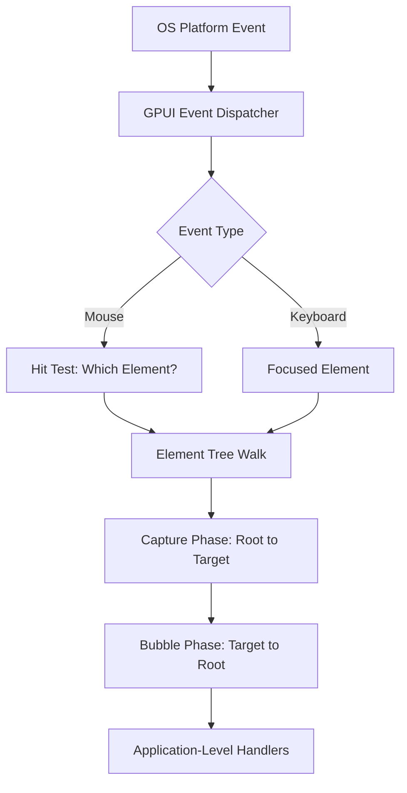

# Part 4: Events, Actions, and Keyboard-Driven UI

Clicking buttons is fine if you're building a kiosk. But Zed is a text editor for people who prefer keyboards to mice. Let's explore GPUI's event system, which powers everything from keyboard shortcuts to drag-and-drop.

## Three Types of Events

GPUI has three event systems, each serving a different purpose:

1. **Input events**: Raw platform events (mouse, keyboard, scroll)
2. **Actions**: High-level semantic events (copy, paste, save file)
3. **Entity events**: Communication between entities

We'll cover the first two in this part. Entity events come in Part 8.

## Input Events: The Raw Feed

Input events come directly from the operating system. When you press a key, move the mouse, or scroll, GPUI receives a platform event and propagates it through the element tree.

Common input events:

- `MouseDownEvent`, `MouseUpEvent`, `MouseMoveEvent`
- `KeyDownEvent`, `KeyUpEvent`
- `ModifiersChangedEvent` (Shift, Ctrl, Cmd, etc.)
- `ScrollWheelEvent`
- `FileDropEvent` (drag-and-drop)

You've seen `.on_click()` in previous parts. That's a convenience method that wraps `MouseDownEvent`. Here's a more detailed example:

```rust
div()
    .on_mouse_down(MouseButton::Left, cx.listener(|this, event, _window, cx| {
        println!("Clicked at position: {:?}", event.position);
        cx.notify();
    }))
    .on_mouse_move(cx.listener(|this, event, _window, cx| {
        println!("Mouse moved to: {:?}", event.position);
    }))
```

The event objects contain useful data:

```rust
pub struct MouseDownEvent {
    pub position: Point<Pixels>,    // Where the click happened
    pub button: MouseButton,         // Left, Right, Middle
    pub modifiers: Modifiers,        // Shift, Ctrl, etc.
    pub click_count: usize,          // 1 for single, 2 for double, etc.
}
```

In Python with a GUI library like Pygame, you'd write:

```python
def handle_event(self, event):
    if event.type == pygame.MOUSEBUTTONDOWN:
        print(f"Clicked at {event.pos}")
```

GPUI's version is type-safe: you can't accidentally access `event.position` if the event is a `KeyDownEvent`. The compiler enforces this.

## Keyboard Events

Let's add keyboard support to the todo list from Part 3. Press 'a' to add an item, 'd' to delete the last one:

```rust
impl Render for TodoList {
    fn render(&mut self, _window: &mut Window, cx: &mut Context<Self>) -> impl IntoElement {
        div()
            .flex()
            .flex_col()
            .size_full()
            .bg(rgb(0x1e1e1e))
            .gap_4()
            .p_8()
            .track_focus(&cx.handle())
            .on_key_down(cx.listener(|this, event, _window, cx| {
                match event.keystroke.key.as_str() {
                    "a" => {
                        this.add_item("New Item".to_string());
                        cx.notify();
                    }
                    "d" => {
                        this.items.pop();
                        cx.notify();
                    }
                    _ => {}
                }
            }))
            .child(
                div()
                    .text_2xl()
                    .font_bold()
                    .text_color(rgb(0xffffff))
                    .child("Todo List (Press 'a' to add, 'd' to delete)")
            )
            // ... rest of the rendering
    }
}
```

New concepts:

### `.track_focus(&cx.handle())`

Elements must opt into receiving keyboard events by tracking focus. `cx.handle()` returns a `FocusHandle` for the current entity. Passing it to `.track_focus()` tells GPUI "this element can receive focus."

Only focused elements receive keyboard events. This is how GPUI knows which element should handle key presses when you have multiple components on screen.

### `.on_key_down()`

This attaches a handler for key presses. The `event` has a `keystroke` field:

```rust
pub struct KeyDownEvent {
    pub keystroke: Keystroke,
}

pub struct Keystroke {
    pub key: String,              // "a", "enter", "escape", etc.
    pub modifiers: Modifiers,     // ctrl, cmd, shift, alt
}
```

You can check for modifiers:

```rust
match event.keystroke {
    Keystroke { key, modifiers } if key == "s" && modifiers.command => {
        // Cmd+S (or Ctrl+S on Windows/Linux)
        this.save();
    }
    _ => {}
}
```

`modifiers.command` is true for Cmd on macOS, Ctrl on Windows/Linux. GPUI abstracts over platform differences so you don't have to write:

```rust
#[cfg(target_os = "macos")]
if modifiers.meta { ... }

#[cfg(not(target_os = "macos"))]
if modifiers.control { ... }
```

This is a small kindness that saves you from cross-platform headaches.

## Focus Management

Focus is subtle. If you run the code above, key presses won't work unless the element has focus. To give it focus automatically when the window opens, use `cx.focus()`:

```rust
fn main() {
    App::new().run(|cx: &mut App| {
        cx.open_window(WindowOptions::default(), |window, cx| {
            let todo_list = cx.new(|cx| {
                let focus_handle = cx.focus_handle();
                TodoList {
                    items: Vec::new(),
                    next_id: 0,
                    focus_handle: focus_handle.clone(),
                }
            });

            window.focus(&todo_list.read(cx).focus_handle);

            todo_list
        })
        .unwrap();
    });
}
```

Wait, we need to store the `FocusHandle` in `TodoList`:

```rust
struct TodoList {
    items: Vec<TodoItem>,
    next_id: usize,
    focus_handle: FocusHandle,
}
```

And get it from `cx` when creating the entity:

```rust
let todo_list = cx.new(|cx| {
    TodoList {
        items: Vec::new(),
        next_id: 0,
        focus_handle: cx.focus_handle(),
    }
});
```

Then focus it:

```rust
window.focus(&todo_list.read(cx).focus_handle);
```

This is verbose. GPUI prioritizes explicitness over convenience here. Focus is a critical part of UI state, and making it explicit prevents bugs where focus ends up somewhere unexpected.

In Python, a GUI library might auto-focus the first widget. GPUI makes you say which one.

## Actions: Semantic Events

Input events are low-level. Press 'a', and you get a `KeyDownEvent` with `keystroke.key == "a"`. But what if you want to define a semantic action like "add todo item" and bind it to 'a', or Cmd+N, or a menu item, or a button?

That's what actions are for.

Actions are defined with the `actions!` macro:

```rust
actions!(todo_list, [AddItem, DeleteItem, ToggleItem]);
```

This declares three action types in the `todo_list` namespace. You can then bind them to keys and handle them:

```rust
impl TodoList {
    fn register_actions(cx: &mut App) {
        cx.bind_keys([
            KeyBinding::new("a", AddItem, None),
            KeyBinding::new("d", DeleteItem, None),
        ]);
    }
}
```

And handle them in your render method:

```rust
div()
    .track_focus(&self.focus_handle)
    .on_action(cx.listener(Self::add_item))
    .on_action(cx.listener(Self::delete_item))
    .child(...)
```

The handler is a method on `self`:

```rust
impl TodoList {
    fn add_item(&mut self, _action: &AddItem, _window: &mut Window, cx: &mut Context<Self>) {
        self.items.push(TodoItem {
            id: self.next_id,
            text: "New Item".to_string(),
            completed: false,
        });
        self.next_id += 1;
        cx.notify();
    }

    fn delete_item(&mut self, _action: &DeleteItem, _window: &mut Window, cx: &mut Context<Self>) {
        self.items.pop();
        cx.notify();
    }
}
```

Now 'a' and 'd' trigger the actions, which call the handlers.

## Why Actions Over Raw Events?

Actions decouple the *what* (add an item) from the *how* (press 'a'). This lets you:

1. **Rebind keys**: Users can customize key bindings without changing code
2. **Multiple triggers**: Bind the same action to a key, a menu item, and a button
3. **Discoverability**: Actions can have doc comments that show up in the command palette
4. **Testing**: Dispatch actions directly in tests without simulating key presses

In Zed, almost everything is an action. Open file? That's an action. Split pane? Action. Toggle line numbers? Action. This is how Zed's command palette works: it lists all available actions and lets you search them.

## Actions with Data

The `actions!` macro is for simple actions with no data. For actions with data, use the `Action` derive macro:

```rust
#[derive(Clone, PartialEq, Action)]
#[action(namespace = todo_list)]
pub struct AddItemWithText {
    pub text: String,
}
```

Now you can dispatch the action with data:

```rust
window.dispatch_action(
    AddItemWithText {
        text: "Buy milk".to_string(),
    }
    .boxed_clone(),
    cx,
);
```

The handler receives the data:

```rust
fn add_item_with_text(
    &mut self,
    action: &AddItemWithText,
    _window: &mut Window,
    cx: &mut Context<Self>,
) {
    self.items.push(TodoItem {
        id: self.next_id,
        text: action.text.clone(),
        completed: false,
    });
    self.next_id += 1;
    cx.notify();
}
```

This is how Zed's "Open File" action works: it takes a file path as data.

## Event Bubbling

When you click an element, the event propagates through the tree. If the element doesn't handle it, the parent gets a chance. This is called *bubbling*, borrowed from HTML's event model.

Example: a button inside a panel:

```rust
div()  // Panel
    .on_click(cx.listener(|_this, _event, _window, _cx| {
        println!("Panel clicked");
    }))
    .child(
        div()  // Button
            .child("Click me")
            .on_click(cx.listener(|_this, _event, _window, _cx| {
                println!("Button clicked");
            }))
    )
```

Click the button, and you'll see:

```
Button clicked
Panel clicked
```

The event bubbles from the button to the panel.

To stop bubbling, consume the event (GPUI's event handlers don't have an explicit "stop propagation" mechanism; you just don't propagate the event by not calling the parent's handler).

Actually, that's a lie. GPUI's event system is more complex. Let me correct that.

In GPUI, event handlers are called during the *bubble phase* by default. If you want to handle an event during the *capture phase* (from root to target), you'd need to use capture handlers, but that's rare. For most cases, bubbling is sufficient.

## Focus and Event Routing

Keyboard events are routed differently from mouse events. Mouse events go to the element under the cursor. Keyboard events go to the *focused* element.

If you have multiple views on screen, only the focused one receives key presses. This is managed via `FocusHandle`:

```rust
// In TodoList
self.focus_handle = cx.focus_handle();

// To focus programmatically
window.focus(&self.focus_handle);

// To check if focused
if self.focus_handle.is_focused(window) {
    // This element has focus
}
```

You can also transfer focus:

```rust
// Focus the next element in tab order
window.focus_next(cx);

// Focus the previous element
window.focus_previous(cx);
```

This is how Tab navigation works. Each focusable element registers itself, and `focus_next` cycles through them.

## Putting It Together: A Keyboard-Driven Todo List

Here's the complete code with actions:

```rust
use gpui::*;

actions!(todo_list, [AddItem, DeleteItem]);

struct TodoItem {
    id: usize,
    text: String,
    completed: bool,
}

struct TodoList {
    items: Vec<TodoItem>,
    next_id: usize,
    focus_handle: FocusHandle,
}

impl TodoList {
    fn new(cx: &mut Context<Self>) -> Self {
        Self {
            items: Vec::new(),
            next_id: 0,
            focus_handle: cx.focus_handle(),
        }
    }

    fn add_item(&mut self, _action: &AddItem, _window: &mut Window, cx: &mut Context<Self>) {
        self.items.push(TodoItem {
            id: self.next_id,
            text: format!("Item {}", self.next_id),
            completed: false,
        });
        self.next_id += 1;
        cx.notify();
    }

    fn delete_item(&mut self, _action: &DeleteItem, _window: &mut Window, cx: &mut Context<Self>) {
        self.items.pop();
        cx.notify();
    }

    fn toggle_item(&mut self, id: usize) {
        if let Some(item) = self.items.iter_mut().find(|item| item.id == id) {
            item.completed = !item.completed;
        }
    }
}

impl Render for TodoList {
    fn render(&mut self, _window: &mut Window, cx: &mut Context<Self>) -> impl IntoElement {
        div()
            .track_focus(&self.focus_handle)
            .on_action(cx.listener(Self::add_item))
            .on_action(cx.listener(Self::delete_item))
            .flex()
            .flex_col()
            .size_full()
            .bg(rgb(0x1e1e1e))
            .gap_4()
            .p_8()
            .child(
                div()
                    .text_2xl()
                    .font_bold()
                    .text_color(rgb(0xffffff))
                    .child("Todo List")
            )
            .child(
                div()
                    .text_sm()
                    .text_color(rgb(0xaaaaaa))
                    .child("Press 'a' to add item, 'd' to delete last item")
            )
            .child(
                div()
                    .flex()
                    .flex_col()
                    .gap_2()
                    .children(
                        self.items.iter().map(|item| {
                            let id = item.id;
                            let text = item.text.clone();
                            let completed = item.completed;

                            div()
                                .flex()
                                .p_3()
                                .rounded_md()
                                .bg(rgb(0x2d2d2d))
                                .cursor_pointer()
                                .hover(|style| style.bg(rgb(0x3d3d3d)))
                                .child(text)
                                .text_color(rgb(0xffffff))
                                .when(completed, |div| {
                                    div.line_through().text_color(rgb(0x888888))
                                })
                                .on_click(cx.listener(move |this, _event, _window, cx| {
                                    this.toggle_item(id);
                                    cx.notify();
                                }))
                        })
                    )
            )
    }
}

fn main() {
    App::new().run(|cx: &mut App| {
        cx.bind_keys([
            KeyBinding::new("a", AddItem, None),
            KeyBinding::new("d", DeleteItem, None),
        ]);

        cx.open_window(WindowOptions::default(), |window, cx| {
            let todo_list = cx.new(|cx| TodoList::new(cx));
            window.focus(&todo_list.read(cx).focus_handle);
            todo_list
        })
        .unwrap();
    });
}
```

Run it. Press 'a' a few times to add items. Press 'd' to delete the last one. Click items to toggle completion.

## Comparison: Python vs. Rust Event Handling

In Python with a framework like Tkinter:

```python
class TodoList:
    def __init__(self, root):
        self.root = root
        self.root.bind("<KeyPress-a>", self.add_item)
        self.root.bind("<KeyPress-d>", self.delete_item)

    def add_item(self, event):
        # Add item
        pass
```

The binding is global. Any key press anywhere in the window triggers the handler.

GPUI is more precise: only the focused element receives keyboard events. This lets you have multiple components with different key bindings coexisting on screen.

## Event System Architecture

Here's how events flow through GPUI:



Most of the time, you work in the bubble phase. Capture phase is for rare cases where a parent needs to intercept events before children see them.

## Advanced: Custom Event Types

You can define custom events (not actions, but events) for specialized use cases. This is rare. Most communication between components should use entity events (Part 8) or state changes.

But if you need it, here's how:

```rust
pub struct CustomEvent {
    pub data: String,
}

impl Event for CustomEvent {}
```

Then dispatch it during rendering or in response to other events. Again, this is uncommon. Start with actions and entity events, and only reach for custom events if you have a specific need.

## Summary

1. **Input events** are low-level platform events (mouse, keyboard, scroll)
2. **Actions** are high-level semantic events (add item, save file)
3. **Focus** determines which element receives keyboard events
4. **Event bubbling** propagates events from target to root
5. **`cx.listener`** creates handlers with access to entity state
6. **`actions!` macro** defines simple actions
7. **`Action` derive** defines actions with data

## What's Next

In Part 5, we'll explore the entity system in depth. You've been using `Entity<T>` since Part 1, but now we'll see how entities communicate, how to structure complex apps with multiple entities, and how to avoid common pitfalls like update-during-update panics.

You now know enough to build a basic interactive UI. The next level is building *maintainable* UIs with multiple components that interact cleanly.
