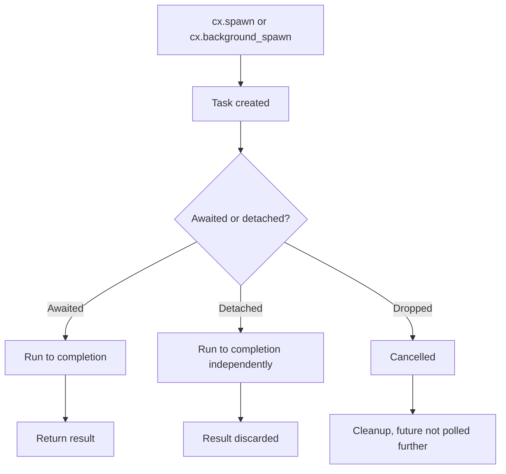

# Part 6: Async Without Tears

Loading a file from disk takes milliseconds. Searching a large codebase takes seconds. Running a language server query could take who-knows-how-long. If your UI blocks waiting for these operations, users will notice. They'll notice in the way that makes them reach for the force-quit shortcut.

GPUI provides async primitives that let you run operations in the background while keeping the UI responsive. This part teaches you how to use them without getting tangled in lifetimes, deadlocks, or race conditions.

## The Single-Threaded Problem

GPUI is single-threaded. All UI updates, rendering, and entity access happen on one thread (the "foreground" thread). This simplifies things: no locks, no data races, no "what if two threads modify this at the same time?"

The downside: if you run a slow operation on the foreground thread, the UI freezes.

In Python with Tkinter, you'd use threads:

```python
import threading

def load_file():
    with open("large_file.txt") as f:
        data = f.read()
    # Now what? Can't update GUI from this thread!
```

You'd need to marshal the result back to the main thread, which is error-prone.

GPUI's solution: async/await on the foreground thread for light tasks, and `background_spawn` for heavy tasks.

## Async on the Foreground: `cx.spawn()`

Use `cx.spawn()` for async operations that don't block the CPU but might take time (like waiting for a network request). The task runs on the foreground thread, so you can access entities directly.

Example: Delay an action by 1 second.

```rust
use gpui::*;
use std::time::Duration;

struct DelayedCounter {
    count: usize,
}

impl Render for DelayedCounter {
    fn render(&mut self, _window: &mut Window, cx: &mut Context<Self>) -> impl IntoElement {
        div()
            .flex()
            .flex_col()
            .size_full()
            .bg(rgb(0x1e1e1e))
            .items_center()
            .justify_center()
            .text_xl()
            .text_color(rgb(0xffffff))
            .child(format!("Count: {}", self.count))
            .child(
                div()
                    .mt_4()
                    .p_2()
                    .bg(rgb(0x0066cc))
                    .rounded_md()
                    .cursor_pointer()
                    .child("Increment (after 1 second)")
                    .on_click(cx.listener(|this, _event, _window, cx| {
                        cx.spawn(async move |this, cx| {
                            cx.background_executor()
                                .timer(Duration::from_secs(1))
                                .await;

                            this.update(cx, |this, cx| {
                                this.count += 1;
                                cx.notify();
                            })
                            .ok();
                        })
                        .detach();
                    }))
            )
    }
}

fn main() {
    App::new().run(|cx: &mut App| {
        cx.open_window(WindowOptions::default(), |window, cx| {
            cx.new(|_cx| DelayedCounter { count: 0 })
        })
        .unwrap();
    });
}
```

Click the button. Wait a second. The counter increments.

### Breaking It Down

```rust
cx.spawn(async move |this, cx| {
    // async closure body
})
```

`cx.spawn()` takes an async closure. The closure receives:

1. **`this: WeakEntity<DelayedCounter>`**: A weak reference to the entity
2. **`cx: AsyncApp`**: An async-safe context for accessing entities

Why `WeakEntity` and not `Entity`? Because the entity might be dropped before the async task completes. If you held a strong reference, the entity would never be dropped (since the task holds it). Weak references allow the entity to be freed.

Inside the async closure:

```rust
cx.background_executor()
    .timer(Duration::from_secs(1))
    .await;
```

`cx.background_executor()` returns a handle to GPUI's executor (task scheduler). `.timer()` creates a future that resolves after the specified duration. `await` yields control until the timer completes.

During this `await`, the foreground thread is free to render frames, handle events, etc. The UI stays responsive.

After the timer:

```rust
this.update(cx, |this, cx| {
    this.count += 1;
    cx.notify();
})
.ok();
```

`this.update()` works like `entity.update()`, but it returns a `Result`. If the entity was dropped, `.update()` returns `Err`. We call `.ok()` to ignore the error (gracefully do nothing if the entity is gone).

Finally:

```rust
.detach();
```

`cx.spawn()` returns a `Task<R>`. If you drop the task, it's cancelled. To let it run independently, call `.detach()`, which says "run this task to completion, even if I don't await it."

## Background Tasks: `cx.background_spawn()`

Use `cx.background_spawn()` for CPU-heavy operations that should run on a thread pool, like parsing a large file or running a regex search.

Example: Count words in a large string.

```rust
use gpui::*;

struct WordCounter {
    text: String,
    word_count: Option<usize>,
}

impl Render for WordCounter {
    fn render(&mut self, _window: &mut Window, cx: &mut Context<Self>) -> impl IntoElement {
        let count_text = self.word_count
            .map(|c| format!("Word count: {}", c))
            .unwrap_or_else(|| "Counting...".to_string());

        div()
            .flex()
            .flex_col()
            .size_full()
            .bg(rgb(0x1e1e1e))
            .items_center()
            .justify_center()
            .text_xl()
            .text_color(rgb(0xffffff))
            .child(count_text)
            .child(
                div()
                    .mt_4()
                    .p_2()
                    .bg(rgb(0x0066cc))
                    .rounded_md()
                    .cursor_pointer()
                    .child("Count words")
                    .on_click(cx.listener(|this, _event, _window, cx| {
                        let text = this.text.clone();

                        cx.spawn(async move |this, cx| {
                            let count = cx.background_spawn(async move {
                                // Heavy computation on background thread
                                text.split_whitespace().count()
                            })
                            .await;

                            this.update(cx, |this, cx| {
                                this.word_count = Some(count);
                                cx.notify();
                            })
                            .ok();
                        })
                        .detach();
                    }))
            )
    }
}

fn main() {
    App::new().run(|cx: &mut App| {
        cx.open_window(WindowOptions::default(), |window, cx| {
            cx.new(|_cx| WordCounter {
                text: "the quick brown fox jumps over the lazy dog ".repeat(10000),
                word_count: None,
            })
        })
        .unwrap();
    });
}
```

Key points:

1. **Clone the data** (`let text = this.text.clone()`) before spawning. Background tasks can't borrow from the entity because the entity might be updated while the task runs.

2. **`cx.background_spawn(async move { ... })`** runs the closure on a thread pool. The closure must return a value that's `Send + 'static` (can be sent across threads and doesn't borrow anything).

3. **Await the result**: `let count = cx.background_spawn(...).await;` brings the result back to the foreground thread.

4. **Update the entity** with the result.

This pattern (spawn background task, await result, update entity) is common in GPUI.

## Chaining Tasks

You can chain multiple async operations:

```rust
cx.spawn(async move |this, cx| {
    // Background task 1
    let result1 = cx.background_spawn(async move {
        expensive_operation_1()
    })
    .await;

    // Background task 2 (depends on result1)
    let result2 = cx.background_spawn(async move {
        expensive_operation_2(result1)
    })
    .await;

    // Update entity with final result
    this.update(cx, |this, cx| {
        this.result = result2;
        cx.notify();
    })
    .ok();
})
.detach();
```

Each `await` yields control. The foreground thread remains responsive throughout.

## Storing Tasks

If you want to cancel a task when the entity is dropped, store the `Task` in a field:

```rust
struct WordCounter {
    text: String,
    word_count: Option<usize>,
    task: Option<Task<()>>,
}

impl WordCounter {
    fn start_counting(&mut self, cx: &mut Context<Self>) {
        let text = self.text.clone();

        self.task = Some(cx.spawn(async move |this, cx| {
            let count = cx.background_spawn(async move {
                text.split_whitespace().count()
            })
            .await;

            this.update(cx, |this, cx| {
                this.word_count = Some(count);
                this.task = None;  // Clear the task
                cx.notify();
            })
            .ok();
        }));
    }
}
```

When `WordCounter` is dropped, the `task` field is dropped, and the task is cancelled.

If you want to cancel manually:

```rust
if let Some(task) = self.task.take() {
    drop(task);  // Cancel the task
}
```

## Error Handling

Background tasks can fail. Handle errors explicitly:

```rust
cx.spawn(async move |this, cx| {
    let result = cx.background_spawn(async move {
        load_file("data.txt")  // Returns Result<String, std::io::Error>
    })
    .await;

    this.update(cx, |this, cx| {
        match result {
            Ok(data) => {
                this.data = data;
            }
            Err(err) => {
                this.error = Some(format!("Failed to load file: {}", err));
            }
        }
        cx.notify();
    })
    .ok();
})
.detach();
```

In Python:

```python
def load_file_async(self):
    try:
        with open("data.txt") as f:
            self.data = f.read()
    except IOError as e:
        self.error = f"Failed to load file: {e}"
```

Rust's version is more verbose but explicit. You can't accidentally ignore errors.

## Parallel Tasks

Run multiple tasks in parallel with `futures::join!`:

```rust
use futures::join;

cx.spawn(async move |this, cx| {
    let (result1, result2, result3) = join!(
        cx.background_spawn(async move { task1() }),
        cx.background_spawn(async move { task2() }),
        cx.background_spawn(async move { task3() }),
    );

    this.update(cx, |this, cx| {
        this.results = vec![result1, result2, result3];
        cx.notify();
    })
    .ok();
})
.detach();
```

`join!` waits for all futures to complete. If you want to proceed as soon as one completes, use `futures::select!`.

## Debouncing: The Classic Async Pattern

Debouncing: delay an action until the user stops triggering it. Example: search-as-you-type, but only search after the user stops typing for 300ms.

```rust
use std::time::Duration;

struct SearchBox {
    query: String,
    results: Vec<String>,
    search_task: Option<Task<()>>,
}

impl SearchBox {
    fn update_query(&mut self, new_query: String, cx: &mut Context<Self>) {
        self.query = new_query.clone();

        // Cancel previous search task
        self.search_task = None;

        // Start new search after 300ms
        self.search_task = Some(cx.spawn(async move |this, cx| {
            cx.background_executor()
                .timer(Duration::from_millis(300))
                .await;

            // Perform search
            let results = cx.background_spawn(async move {
                search_database(&new_query)
            })
            .await;

            this.update(cx, |this, cx| {
                this.results = results;
                this.search_task = None;
                cx.notify();
            })
            .ok();
        }));
    }
}
```

Each time the query changes, the old task is dropped (cancelled), and a new one starts. If the user types "hello" quickly, only the final search (after they stop typing) runs.

## Python Comparison: asyncio

Python's `asyncio` is similar but less strict:

```python
import asyncio

async def count_words(text):
    # Simulate heavy computation
    await asyncio.sleep(1)
    return len(text.split())

async def main():
    text = "the quick brown fox"
    count = await count_words(text)
    print(f"Word count: {count}")

asyncio.run(main())
```

Rust's version requires more ceremony (cloning data, handling `Result`, weak entities), but you get compile-time guarantees that you won't:

- Access data that's been freed
- Forget to handle errors
- Create data races by accessing the same data from multiple threads

## The Task Lifecycle



If you forget to await or detach, the task is cancelled when it goes out of scope.

## Common Mistakes

### Mistake 1: Forgetting to Clone

```rust
// BAD: Borrowing from entity
cx.spawn(async move |this, cx| {
    let text = &this.text;  // ERROR: can't borrow across await
    // ...
});
```

Clone the data before spawning:

```rust
let text = this.text.clone();
cx.spawn(async move |this, cx| {
    // Use `text` here
});
```

### Mistake 2: Forgetting to Detach

```rust
// BAD: Task is dropped immediately
cx.spawn(async move |this, cx| {
    // ...
});
// Task cancelled here!
```

Detach it:

```rust
cx.spawn(async move |this, cx| {
    // ...
})
.detach();
```

### Mistake 3: Blocking the Foreground Thread

```rust
// BAD: Running heavy computation on foreground thread
cx.spawn(async move |this, cx| {
    let result = heavy_computation();  // Blocks the UI!
    this.update(cx, |this, cx| {
        this.result = result;
        cx.notify();
    });
});
```

Use `background_spawn`:

```rust
cx.spawn(async move |this, cx| {
    let result = cx.background_spawn(async move {
        heavy_computation()
    })
    .await;

    this.update(cx, |this, cx| {
        this.result = result;
        cx.notify();
    });
})
.detach();
```

## Summary

1. **`cx.spawn()`** runs async code on the foreground thread
2. **`cx.background_spawn()`** runs CPU-heavy code on a thread pool
3. **Await background tasks**, then update entities on the foreground
4. **Detach tasks** with `.detach()` if you don't need to await them
5. **Store tasks** to cancel them when the entity is dropped
6. **Clone data** before moving it into async closures
7. **Use `WeakEntity`** in async closures to avoid leaking entities

## What's Next

In Part 7, we'll explore advanced styling and layout: flexbox, absolute positioning, responsive design, and how to build complex UIs that adapt to window resizing. You'll also learn about GPUI's layout engine (Taffy) and how to optimize rendering performance.

You can now build responsive UIs that handle async operations gracefully. The next step is making them look good.
