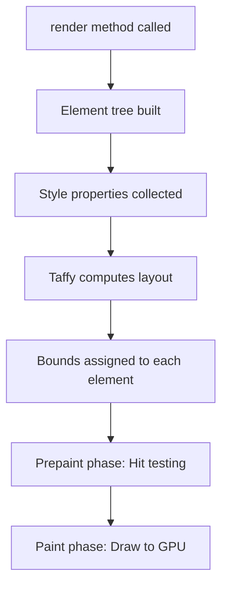

# Part 7: Styling, Layout, and Making Things Look Less Terrible

You've built functional UIs. Now let's make them not look like they were designed by someone who thought Comic Sans was a reasonable choice. GPUI's styling system is inspired by Tailwind CSS and powered by Taffy (a flexbox layout engine). If you know CSS, you're already halfway there.

## The Styled Trait

Every element that implements `Styled` gets access to 200+ styling methods. `div()` implements it. So do most built-in elements. The methods chain, returning `self`, so you can write:

```rust
div()
    .flex()
    .flex_col()
    .gap_4()
    .p_8()
    .bg(rgb(0x1e1e1e))
    .rounded_lg()
    .shadow_lg()
    .child(...)
```

Each method sets a property. Let's explore the most important ones.

## Flexbox: The Core Layout Model

GPUI uses flexbox for layout, just like modern CSS. If you've used CSS flexbox, this will feel familiar. If not, here's the mental model:

A flex container has:

- **Main axis**: The primary direction (horizontal or vertical)
- **Cross axis**: The perpendicular direction
- **Children**: Items arranged along the main axis

Example: A row of buttons.

```rust
div()
    .flex()              // Enable flexbox
    .flex_row()          // Main axis: horizontal (default)
    .gap_2()             // Space between children
    .child("Button 1")
    .child("Button 2")
    .child("Button 3")
```

The buttons are laid out horizontally with a gap between them.

To stack them vertically:

```rust
div()
    .flex()
    .flex_col()          // Main axis: vertical
    .gap_2()
    .child("Button 1")
    .child("Button 2")
    .child("Button 3")
```

## Alignment

Control how children are positioned:

```rust
div()
    .flex()
    .flex_row()
    .items_center()      // Align children along cross axis (vertical centering for row)
    .justify_center()    // Align children along main axis (horizontal centering for row)
    .child("Centered!")
```

- **`items_start()`**, **`items_center()`**, **`items_end()`**: Cross-axis alignment
- **`justify_start()`**, **`justify_center()`**, **`justify_end()`**, **`justify_between()`**: Main-axis alignment

`justify_between()` is useful for spreading items:

```rust
div()
    .flex()
    .flex_row()
    .justify_between()
    .child("Left")
    .child("Right")
```

The children are pushed to the edges with space between them.

## Sizing

Elements have three sizing modes:

### 1. Auto (default)

The element's size is determined by its content.

```rust
div()
    .child("I'm as wide as this text")
```

### 2. Fixed Size

Set explicit width and height:

```rust
div()
    .w(px(200.0))       // Width: 200 pixels
    .h(px(100.0))       // Height: 100 pixels
    .bg(rgb(0x0066cc))
```

GPUI uses `Pixels` (not `f32` or `usize`) for sizes. `px(200.0)` converts a float to `Pixels`.

You can also use:

- **`w_full()`, `h_full()`**: 100% of parent
- **`w_1_2()`, `h_1_2()`**: 50% of parent (1/2)
- **`size_full()`**: Both width and height to 100%

### 3. Flex Grow

Tell a child to take up remaining space:

```rust
div()
    .flex()
    .flex_row()
    .size_full()
    .child(
        div()
            .w(px(200.0))
            .bg(rgb(0xff0000))
            .child("Sidebar")
    )
    .child(
        div()
            .flex_1()       // Take up remaining space
            .bg(rgb(0x0000ff))
            .child("Main content")
    )
```

The sidebar is 200px wide. The main content fills the rest.

`flex_1()` is shorthand for `.flex_grow(1.0)`. You can use fractional values:

```rust
.child(div().flex_1())   // 1 part
.child(div().flex_2())   // 2 parts (twice as wide)
```

## Padding and Margin

Padding: space inside the element. Margin: space outside.

```rust
div()
    .p_4()               // Padding: 4 units on all sides
    .m_2()               // Margin: 2 units on all sides
    .child("Content")
```

You can control each side individually:

- **`pt_4()`**: Padding top
- **`pb_4()`**: Padding bottom
- **`pl_4()`**: Padding left
- **`pr_4()`**: Padding right
- **`px_4()`**: Padding horizontal (left and right)
- **`py_4()`**: Padding vertical (top and bottom)

Same for margin: `mt_4()`, `mb_4()`, etc.

The numbers (like `_4`) correspond to a spacing scale. Larger numbers = more space. The scale is roughly:

- `_1`: 0.25rem (4px)
- `_2`: 0.5rem (8px)
- `_4`: 1rem (16px)
- `_8`: 2rem (32px)

(Exact values depend on GPUI's config.)

## Colors

Use `rgb()` or `rgba()` for colors:

```rust
div()
    .bg(rgb(0x1e1e1e))                  // Background: dark gray
    .text_color(rgb(0xffffff))          // Text: white
    .border_1()
    .border_color(rgba(0xff0000ff))     // Border: red with full alpha
```

`rgb()` takes a 24-bit hex value. `rgba()` takes a 32-bit hex value (last 2 digits = alpha).

You can also use `gpui::rgb` with separate RGB values:

```rust
use gpui::rgb;

div().bg(rgb(30, 30, 30))  // RGB: (30, 30, 30)
```

## Borders and Rounded Corners

```rust
div()
    .border_1()           // Border width: 1px
    .border_color(rgb(0xcccccc))
    .rounded_md()         // Rounded corners: medium
```

Border widths: `border_1()`, `border_2()`, `border_4()`.

Rounded corners: `rounded_sm()`, `rounded_md()`, `rounded_lg()`, `rounded_full()` (circle).

You can control individual corners:

```rust
div()
    .rounded_tl_lg()      // Top-left: large
    .rounded_br_lg()      // Bottom-right: large
```

## Shadows

```rust
div()
    .shadow_sm()          // Small shadow
    .shadow_md()          // Medium shadow
    .shadow_lg()          // Large shadow
```

Shadows give depth, making elements appear elevated.

## Text Styling

```rust
div()
    .text_sm()            // Small text
    .text_base()          // Base size (default)
    .text_lg()            // Large
    .text_xl()            // Extra large
    .text_2xl()           // 2x large
    .font_bold()          // Bold
    .font_semibold()      // Semi-bold
    .text_color(rgb(0xffffff))
    .line_height(relative(1.5))  // Line height: 1.5x font size
    .child("Styled text")
```

## Hover and Active States

Change styling based on interaction:

```rust
div()
    .bg(rgb(0x0066cc))
    .hover(|style| style.bg(rgb(0x0052a3)))       // Darker on hover
    .active(|style| style.bg(rgb(0x004080)))      // Even darker when pressed
    .cursor_pointer()
    .child("Button")
```

The closures receive the element and return it with modified styles. This is how you implement interactive buttons without JavaScript-style state management.

## Absolute Positioning

By default, elements are positioned by flexbox. For overlays or tooltips, use absolute positioning:

```rust
div()
    .relative()          // Parent is the positioning context
    .size_full()
    .child(
        div()
            .child("Main content")
    )
    .child(
        div()
            .absolute()
            .top_4()
            .right_4()
            .bg(rgb(0xff0000))
            .p_2()
            .rounded_md()
            .child("Notification badge")
    )
```

The badge is positioned absolutely, 4 units from the top and right of the parent.

## Z-Index

Control stacking order:

```rust
div()
    .z_index(10)
    .child("I'm on top")
```

Higher values = closer to the front.

## Overflow and Scrolling

By default, content that overflows is clipped. To enable scrolling:

```rust
div()
    .size_full()
    .overflow_y_scroll()     // Vertical scrolling
    .children(
        (0..100).map(|i| {
            div().child(format!("Item {}", i))
        })
    )
```

- **`overflow_hidden()`**: Clip overflow (default)
- **`overflow_scroll()`**: Scroll both axes
- **`overflow_x_scroll()`, `overflow_y_scroll()`**: Scroll one axis

## Building a Sidebar Layout

Let's put it together: a two-pane layout with a sidebar and main content.

```rust
use gpui::*;

struct App {
    sidebar_width: Pixels,
}

impl Render for App {
    fn render(&mut self, _window: &mut Window, _cx: &mut Context<Self>) -> impl IntoElement {
        div()
            .flex()
            .flex_row()
            .size_full()
            .bg(rgb(0x1e1e1e))
            .child(
                // Sidebar
                div()
                    .flex()
                    .flex_col()
                    .w(self.sidebar_width)
                    .h_full()
                    .bg(rgb(0x252526))
                    .p_4()
                    .gap_2()
                    .child(
                        div()
                            .text_xl()
                            .font_bold()
                            .text_color(rgb(0xffffff))
                            .child("Files")
                    )
                    .children(
                        (0..20).map(|i| {
                            div()
                                .p_2()
                                .rounded_md()
                                .hover(|style| style.bg(rgb(0x2a2d2e)))
                                .cursor_pointer()
                                .text_color(rgb(0xcccccc))
                                .child(format!("file_{}.rs", i))
                        })
                    )
            )
            .child(
                // Main content
                div()
                    .flex_1()
                    .flex()
                    .flex_col()
                    .h_full()
                    .bg(rgb(0x1e1e1e))
                    .p_8()
                    .child(
                        div()
                            .text_2xl()
                            .font_bold()
                            .text_color(rgb(0xffffff))
                            .mb_4()
                            .child("Main Content")
                    )
                    .child(
                        div()
                            .text_color(rgb(0xaaaaaa))
                            .child("This is where your content goes.")
                    )
            )
    }
}

fn main() {
    App::new().run(|cx: &mut App| {
        cx.open_window(WindowOptions::default(), |window, cx| {
            cx.new(|_cx| App {
                sidebar_width: px(250.0),
            })
        })
        .unwrap();
    });
}
```

This creates a dark-themed layout with a fixed-width sidebar and a flexible main content area.

## Responsive Design

GPUI doesn't have media queries like CSS, but you can compute styles based on window size:

```rust
impl Render for App {
    fn render(&mut self, window: &mut Window, _cx: &mut Context<Self>) -> impl IntoElement {
        let window_size = window.viewport_size();

        let sidebar_width = if window_size.width < px(600.0) {
            px(0.0)  // Hide sidebar on small screens
        } else {
            px(250.0)
        };

        div()
            .flex()
            .flex_row()
            .size_full()
            .when(sidebar_width > px(0.0), |div| {
                div.child(
                    // Sidebar
                    div().w(sidebar_width).child("Sidebar")
                )
            })
            .child(
                // Main content
                div().flex_1().child("Content")
            )
    }
}
```

`window.viewport_size()` gives you the window's dimensions. Use `.when()` to conditionally include the sidebar.

## The Layout Pipeline

Here's how GPUI computes layout:



Taffy is a Rust implementation of flexbox (and soon, grid). It's fast: Zed uses it to layout hundreds of elements at 60 FPS.

## Performance: Caching and Lazy Rendering

Rendering is cheap, but not free. For complex UIs, cache elements that don't change:

```rust
impl Render for App {
    fn render(&mut self, _window: &mut Window, _cx: &mut Context<Self>) -> impl IntoElement {
        let sidebar = self.render_sidebar();  // Expensive

        div()
            .child(sidebar.cached(StyleRefinement::default()))
            .child(self.render_content())
    }
}
```

`.cached()` tells GPUI to reuse the previous render if the style and content haven't changed. This is most useful for large lists or complex components.

## Lists: Uniform List for Performance

Rendering 10,000 items with `.children()` is slow. Use `UniformList` for virtual scrolling:

```rust
use gpui::*;

struct LargeList {
    items: Vec<String>,
}

impl Render for LargeList {
    fn render(&mut self, _window: &mut Window, _cx: &mut Context<Self>) -> impl IntoElement {
        uniform_list(
            |item: &String, _cx| {
                div()
                    .p_2()
                    .child(item.clone())
            },
            self.items.len(),
            move |range, _cx| {
                self.items[range].iter().cloned().collect()
            },
        )
    }
}
```

`uniform_list` only renders visible items. As you scroll, it recycles elements. This is how Zed's file tree and editor handle thousands of lines without slowing down.

## Common Layout Patterns

### Centering

Horizontal and vertical centering:

```rust
div()
    .flex()
    .items_center()
    .justify_center()
    .size_full()
    .child("I'm centered!")
```

### Sticky Header

A header that stays at the top:

```rust
div()
    .flex()
    .flex_col()
    .size_full()
    .child(
        // Header
        div()
            .h(px(60.0))
            .bg(rgb(0x252526))
            .child("Header")
    )
    .child(
        // Scrollable content
        div()
            .flex_1()
            .overflow_y_scroll()
            .children(...)
    )
```

### Split Panes

Resizable split panes are harder. You'd store the split ratio and update it on drag. Example (simplified):

```rust
struct SplitPane {
    split_ratio: f32,  // 0.0 to 1.0
}

impl Render for SplitPane {
    fn render(&mut self, window: &mut Window, _cx: &mut Context<Self>) -> impl IntoElement {
        let total_width = window.viewport_size().width;
        let left_width = total_width * self.split_ratio;

        div()
            .flex()
            .flex_row()
            .size_full()
            .child(
                div()
                    .w(left_width)
                    .child("Left pane")
            )
            .child(
                div()
                    .flex_1()
                    .child("Right pane")
            )
    }
}
```

Handling drag to adjust `split_ratio` is left as an exercise (hint: `.on_mouse_move()` and tracking drag state).

## Python Comparison: CSS in JS

In Python GUI frameworks, you often set styles imperatively:

```python
button = tk.Button(root, text="Click me")
button.config(bg="#0066cc", fg="#ffffff", padx=10, pady=5)
```

GPUI's declarative style is closer to React with styled-components:

```javascript
const Button = styled.div`
  background: #0066cc;
  color: #ffffff;
  padding: 10px;
  border-radius: 4px;
`;
```

But Rust's version is type-safe: you can't accidentally set `padding: "large"` (not a valid value). The compiler enforces correct types.

## Summary

1. **Flexbox** is the primary layout model
2. **`.flex()`, `.flex_row()`, `.flex_col()`** control flex direction
3. **`.items_*()` and `.justify_*()`** control alignment
4. **`.p_*()`, `.m_*()`** control padding and margin
5. **`.bg()`, `.text_color()`, `.border_*()`** control appearance
6. **`.hover()` and `.active()`** handle interactive states
7. **`.absolute()`** and `.relative()`** for overlays
8. **`uniform_list()`** for performant large lists
9. **`.cached()`** for expensive elements that don't change often

## What's Next

In Part 8, we'll explore the final piece of GPUI's puzzle: subscriptions, observers, and reactive patterns. You'll learn how entities communicate through events, how to make views re-render when other entities change, and how to build reactive UIs where data flows cleanly through the component tree.

You now know how to make UIs that don't look like they were assembled by a committee of colorblind raccoons. The next challenge is making them react to changes gracefully.
