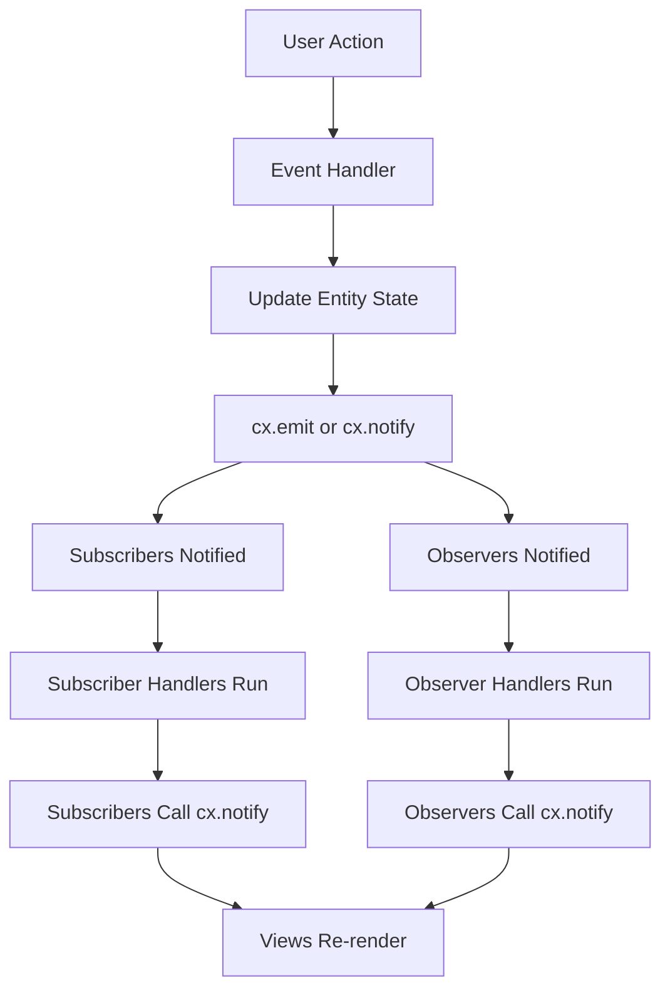

# Part 8: Subscriptions, Observers, and Reactive Patterns

You've built components that respond to user input. Now let's make components that respond to *each other*. This is where GPUI's reactive model shines: entities can emit events, and other entities can subscribe to them. No callbacks hell, no message buses, no Redux-style action dispatchers. Just clean, type-safe subscriptions.

## The Problem: Components That Need to Talk

Imagine a music player with:

- A `Player` entity that manages playback state (playing, paused, current track)
- A `PlayButton` view that shows play/pause
- A `TrackDisplay` view that shows the current track
- A `VolumeControl` view that adjusts volume

When the player starts a new track, both `PlayButton` and `TrackDisplay` need to update. How?

In Python with a traditional GUI framework, you'd use callbacks:

```python
class Player:
    def __init__(self):
        self.listeners = []

    def add_listener(self, callback):
        self.listeners.append(callback)

    def play_track(self, track):
        self.current_track = track
        for listener in self.listeners:
            listener(track)

# In the view
player.add_listener(lambda track: self.update_display(track))
```

This works but is error-prone. Forgetting to remove listeners causes memory leaks. There's no type checking: any callable can be a listener, even if it expects the wrong arguments.

GPUI's solution: entity events and subscriptions.

## Entity Events: The Foundation

An entity can emit events. Other entities can subscribe to them. The event types are defined explicitly, giving you compile-time safety.

### Step 1: Define an Event

```rust
pub struct TrackChanged {
    pub track_name: String,
}
```

Events are just structs. No trait to implement, no magic.

### Step 2: Declare That Your Entity Emits It

```rust
use gpui::*;

struct Player {
    current_track: String,
    is_playing: bool,
}

impl EventEmitter<TrackChanged> for Player {}
```

`EventEmitter<TrackChanged>` is a marker trait. It tells GPUI "this entity can emit `TrackChanged` events."

### Step 3: Emit the Event

```rust
impl Player {
    fn play_track(&mut self, track_name: String, cx: &mut Context<Self>) {
        self.current_track = track_name.clone();
        self.is_playing = true;
        cx.emit(TrackChanged { track_name });
        cx.notify();
    }
}
```

`cx.emit(event)` sends the event to all subscribers.

### Step 4: Subscribe to the Event

```rust
struct TrackDisplay {
    player: Entity<Player>,
    current_track: String,
    _subscriptions: Vec<Subscription>,
}

impl TrackDisplay {
    fn new(player: Entity<Player>, cx: &mut Context<Self>) -> Self {
        let subscription = cx.subscribe(&player, |this, _player, event: &TrackChanged, cx| {
            this.current_track = event.track_name.clone();
            cx.notify();
        });

        Self {
            player,
            current_track: String::new(),
            _subscriptions: vec![subscription],
        }
    }
}
```

`cx.subscribe(&player, closure)` registers a callback. When `player` emits `TrackChanged`, the closure is called with:

1. **`this: &mut TrackDisplay`**: The subscribing entity
2. **`_player: Entity<Player>`**: The emitter
3. **`event: &TrackChanged`**: The event
4. **`cx: &mut Context<TrackDisplay>`**: The subscriber's context

The subscription is stored in `_subscriptions`. When `TrackDisplay` is dropped, the subscription is dropped, and the callback is automatically unregistered. No manual cleanup.

## Observers: React to Any State Change

Subscriptions work for specific events. What if you just want to know "this entity changed somehow"? Use observers.

```rust
struct PlayButton {
    player: Entity<Player>,
    _subscriptions: Vec<Subscription>,
}

impl PlayButton {
    fn new(player: Entity<Player>, cx: &mut Context<Self>) -> Self {
        let subscription = cx.observe(&player, |this, _player, cx| {
            // Player changed; re-render the button
            cx.notify();
        });

        Self {
            player,
            _subscriptions: vec![subscription],
        }
    }
}

impl Render for PlayButton {
    fn render(&mut self, _window: &mut Window, cx: &mut Context<Self>) -> impl IntoElement {
        let is_playing = self.player.read(cx).is_playing;

        div()
            .child(if is_playing { "Pause" } else { "Play" })
            .on_click(cx.listener(|this, _event, _window, cx| {
                this.player.update(cx, |player, cx| {
                    player.is_playing = !player.is_playing;
                    cx.notify();
                });
            }))
    }
}
```

When `player` calls `cx.notify()`, the observer's closure is invoked. `PlayButton` re-renders, reading the updated state.

This is reactive programming: changes in one entity automatically propagate to others.

## The Difference: Events vs. Observers

| Feature | Events (`cx.subscribe`) | Observers (`cx.observe`) |
|---------|-------------------------|--------------------------|
| **When?** | When a specific event is emitted | Whenever `cx.notify()` is called |
| **Data?** | Event struct with payload | No data; just a notification |
| **Use case** | "Player started a new track" | "Player state changed somehow" |

Use events when you need to pass data. Use observers for simple "something changed" notifications.

## A Complete Example: Music Player

Let's build a simple music player with subscriptions and observers.

```rust
use gpui::*;

// Event: Track changed
pub struct TrackChanged {
    pub track_name: String,
}

// Entity: Player
struct Player {
    current_track: String,
    is_playing: bool,
}

impl EventEmitter<TrackChanged> for Player {}

impl Player {
    fn new() -> Self {
        Self {
            current_track: "No track".to_string(),
            is_playing: false,
        }
    }

    fn play_track(&mut self, track_name: String, cx: &mut Context<Self>) {
        self.current_track = track_name.clone();
        self.is_playing = true;
        cx.emit(TrackChanged { track_name });
        cx.notify();
    }

    fn toggle_playback(&mut self, cx: &mut Context<Self>) {
        self.is_playing = !self.is_playing;
        cx.notify();
    }
}

// View: TrackDisplay (subscribes to TrackChanged event)
struct TrackDisplay {
    player: Entity<Player>,
    current_track: String,
    _subscriptions: Vec<Subscription>,
}

impl TrackDisplay {
    fn new(player: Entity<Player>, cx: &mut Context<Self>) -> Self {
        let subscription = cx.subscribe(&player, |this, _player, event: &TrackChanged, cx| {
            this.current_track = event.track_name.clone();
            cx.notify();
        });

        Self {
            player,
            current_track: "No track".to_string(),
            _subscriptions: vec![subscription],
        }
    }
}

impl Render for TrackDisplay {
    fn render(&mut self, _window: &mut Window, _cx: &mut Context<Self>) -> impl IntoElement {
        div()
            .text_xl()
            .text_color(rgb(0xffffff))
            .child(format!("Now playing: {}", self.current_track))
    }
}

// View: PlayButton (observes Player)
struct PlayButton {
    player: Entity<Player>,
    _subscriptions: Vec<Subscription>,
}

impl PlayButton {
    fn new(player: Entity<Player>, cx: &mut Context<Self>) -> Self {
        let subscription = cx.observe(&player, |_this, _player, cx| {
            cx.notify();
        });

        Self {
            player,
            _subscriptions: vec![subscription],
        }
    }
}

impl Render for PlayButton {
    fn render(&mut self, _window: &mut Window, cx: &mut Context<Self>) -> impl IntoElement {
        let is_playing = self.player.read(cx).is_playing;

        div()
            .p_2()
            .px_4()
            .bg(rgb(0x0066cc))
            .text_color(rgb(0xffffff))
            .rounded_md()
            .cursor_pointer()
            .hover(|style| style.bg(rgb(0x0052a3)))
            .child(if is_playing { "Pause" } else { "Play" })
            .on_click(cx.listener(|this, _event, _window, cx| {
                this.player.update(cx, |player, cx| {
                    player.toggle_playback(cx);
                });
            }))
    }
}

// Main app
struct MusicPlayer {
    player: Entity<Player>,
    track_display: Entity<TrackDisplay>,
    play_button: Entity<PlayButton>,
}

impl Render for MusicPlayer {
    fn render(&mut self, _window: &mut Window, cx: &mut Context<Self>) -> impl IntoElement {
        div()
            .flex()
            .flex_col()
            .size_full()
            .bg(rgb(0x1e1e1e))
            .items_center()
            .justify_center()
            .gap_4()
            .child(self.track_display.clone())
            .child(self.play_button.clone())
            .child(
                div()
                    .p_2()
                    .px_4()
                    .bg(rgb(0x00aa00))
                    .text_color(rgb(0xffffff))
                    .rounded_md()
                    .cursor_pointer()
                    .hover(|style| style.bg(rgb(0x008800)))
                    .child("Play Track 1")
                    .on_click(cx.listener(|this, _event, _window, cx| {
                        this.player.update(cx, |player, cx| {
                            player.play_track("Track 1".to_string(), cx);
                        });
                    }))
            )
            .child(
                div()
                    .p_2()
                    .px_4()
                    .bg(rgb(0x00aa00))
                    .text_color(rgb(0xffffff))
                    .rounded_md()
                    .cursor_pointer()
                    .hover(|style| style.bg(rgb(0x008800)))
                    .child("Play Track 2")
                    .on_click(cx.listener(|this, _event, _window, cx| {
                        this.player.update(cx, |player, cx| {
                            player.play_track("Track 2".to_string(), cx);
                        });
                    }))
            )
    }
}

fn main() {
    App::new().run(|cx: &mut App| {
        cx.open_window(WindowOptions::default(), |window, cx| {
            cx.new(|cx| {
                let player = cx.new(|_cx| Player::new());
                let track_display = cx.new(|cx| TrackDisplay::new(player.clone(), cx));
                let play_button = cx.new(|cx| PlayButton::new(player.clone(), cx));

                MusicPlayer {
                    player,
                    track_display,
                    play_button,
                }
            })
        })
        .unwrap();
    });
}
```

Run this. Click "Play Track 1". The track display updates (via the `TrackChanged` event), and the button updates (via the observer). Click "Play" or "Pause". The button label changes (via the observer).

## Global State with Observers

You can also observe global state. Example: theme switching.

```rust
#[derive(Global)]
struct Theme {
    background: Rgb,
    foreground: Rgb,
}

struct ThemedView {
    _subscriptions: Vec<Subscription>,
}

impl ThemedView {
    fn new(cx: &mut Context<Self>) -> Self {
        let subscription = cx.observe_global::<Theme>(|_this, cx| {
            cx.notify();  // Re-render when theme changes
        });

        Self {
            _subscriptions: vec![subscription],
        }
    }
}

impl Render for ThemedView {
    fn render(&mut self, _window: &mut Window, cx: &mut Context<Self>) -> impl IntoElement {
        let theme = Theme::global(cx);

        div()
            .bg(theme.background)
            .text_color(theme.foreground)
            .child("I use the global theme")
    }
}
```

When `Theme::update_global(cx, |theme, cx| ...)` is called, all observers of `Theme` are notified.

## Data Flow Architecture

Here's how data flows in a GPUI app:



This is unidirectional data flow:

1. User action triggers an update
2. Entity state changes
3. Events/observers propagate changes
4. Views re-render

Compare to Python's MVC pattern:

```python
# Model
class Player:
    def play_track(self, track):
        self.current_track = track
        self.notify_observers()

# View
class TrackDisplay:
    def update(self, track):
        self.label.config(text=f"Now playing: {track}")

# Controller
player.add_observer(track_display.update)
```

GPUI's version is more structured and type-safe. You can't accidentally pass the wrong event type to a subscriber.

## Advanced: Chaining Subscriptions

You can chain subscriptions: A subscribes to B, B subscribes to C. When C emits an event, it propagates through B to A.

Example: A workspace that observes all open editors.

```rust
struct Workspace {
    editors: Vec<Entity<Editor>>,
    _subscriptions: Vec<Subscription>,
}

impl Workspace {
    fn add_editor(&mut self, editor: Entity<Editor>, cx: &mut Context<Self>) {
        let subscription = cx.observe(&editor, |this, _editor, cx| {
            // Any editor changed; update workspace
            cx.notify();
        });

        self.editors.push(editor);
        self._subscriptions.push(subscription);
    }
}
```

When any editor calls `cx.notify()`, the workspace is notified.

## Avoiding Infinite Loops

Be careful with cyclic dependencies. If A observes B and B observes A, and both call `cx.notify()` in their observers, you'll get an infinite loop (or a stack overflow).

Solution: Break the cycle. Use events to propagate changes in one direction only.

## Python Comparison: Observer Pattern

Python's observer pattern is manual:

```python
class Observable:
    def __init__(self):
        self._observers = []

    def add_observer(self, callback):
        self._observers.append(callback)

    def notify(self):
        for callback in self._observers:
            callback()
```

GPUI's version is automatic: storing the `Subscription` in a field is all you need. When the subscriber is dropped, the subscription is automatically removed.

## Summary

1. **Events** are structs emitted with `cx.emit(event)`
2. **`EventEmitter<E>`** marks an entity as capable of emitting an event
3. **`cx.subscribe(&entity, closure)`** subscribes to specific events
4. **`cx.observe(&entity, closure)`** observes any state change
5. **Subscriptions** are stored in a `Vec<Subscription>` field
6. **Observers** enable reactive data flow
7. **Global state** can be observed with `cx.observe_global::<T>()`

## What's Next

In Part 9, we'll build a real component from scratch: a custom text input with selection, cursor movement, and clipboard support. You'll see how to handle complex state, low-level rendering with the `Element` trait, and text shaping. This is where you'll put together everything you've learned into something useful.

You now understand how GPUI's reactive model works. The next challenge is building something that feels like a real UI component, not a toy example.
