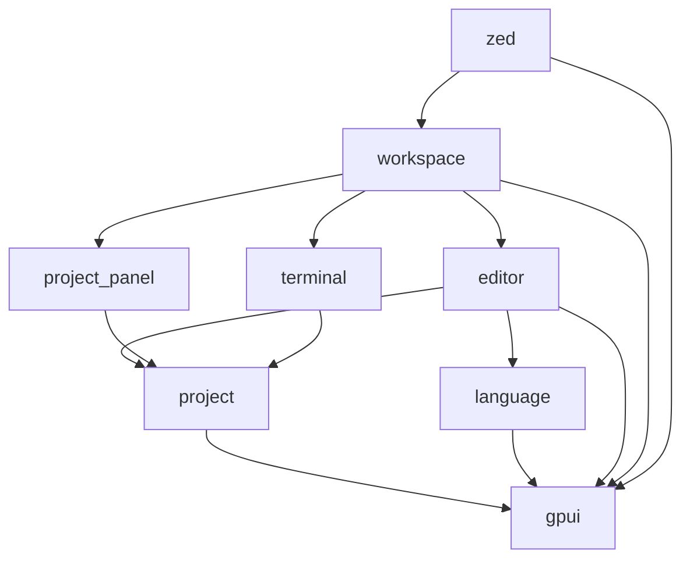

# Part 10: Contributing to Zed and Advanced Patterns

You've learned GPUI. You've built components. Now let's look at how Zed itself uses GPUI, and how you can contribute to a production-grade codebase.

## The Zed Architecture

Zed is organized into crates (Rust's term for packages or modules). Each crate has a specific responsibility:

```
crates/
├── gpui/               # The UI framework (you know this)
├── editor/             # The text editor component
├── workspace/          # Window and pane management
├── project/            # Project and file management
├── project_panel/      # File tree sidebar
├── terminal/           # Integrated terminal
├── collab/             # Collaboration features
├── language/           # Language server protocol integration
├── theme/              # Theming system
├── settings/           # User settings
└── zed/                # Main application entry point
```

Each crate can depend on others. The dependency graph looks roughly like this:



All UI components depend on GPUI. Higher-level components (like `workspace`) depend on lower-level ones (like `editor`).

## Navigating the Codebase

Let's find where something happens. Say you want to understand how the "Open File" command works.

### Step 1: Grep for Actions

Actions have unique names. Search for the action definition:

```bash
rg "actions.*OpenFile" --type rust
```

You'll find something like:

```rust
// In crates/workspace/src/workspace.rs
actions!(workspace, [OpenFile, SaveFile, ClosePane, ...]);
```

### Step 2: Find the Handler

Actions are handled with `.on_action()`. Search for where this action is handled:

```bash
rg "on_action.*OpenFile" --type rust
```

Or search for the handler method directly:

```bash
rg "fn.*open_file" --type rust
```

You'll find:

```rust
// In crates/workspace/src/workspace.rs
impl Workspace {
    fn open_file(&mut self, _action: &OpenFile, window: &mut Window, cx: &mut Context<Self>) {
        // ... implementation
    }
}
```

### Step 3: Read the Code

Follow the implementation. If it calls other methods or interacts with other entities, trace those too.

This is how you learn a codebase: start with a feature, find its action, read the handler, follow the dependencies.

## Advanced Pattern: Custom Elements

Zed's editor doesn't use the `Render` trait. It implements the `Element` trait directly for fine-grained control over layout and painting.

Here's a simplified version of how it works:

```rust
pub struct EditorElement {
    editor: WeakEntity<Editor>,
}

impl Element for EditorElement {
    type RequestLayoutState = LayoutState;
    type PrepaintState = PrepaintState;

    fn request_layout(
        &mut self,
        id: Option<&GlobalElementId>,
        window: &mut Window,
        cx: &mut App,
    ) -> (LayoutId, Self::RequestLayoutState) {
        let editor = self.editor.upgrade().unwrap();
        let editor = editor.read(cx);

        // Compute layout based on editor state
        let mut style = Style::default();
        style.size.width = relative(1.).into();
        style.size.height = auto();

        let layout_id = window.request_layout(style, [], cx);

        let state = LayoutState {
            line_height: editor.line_height,
            visible_lines: editor.visible_lines(),
            // ... more state
        };

        (layout_id, state)
    }

    fn prepaint(
        &mut self,
        _id: Option<&GlobalElementId>,
        bounds: Bounds<Pixels>,
        layout: &mut Self::RequestLayoutState,
        window: &mut Window,
        cx: &mut App,
    ) -> Self::PrepaintState {
        let editor = self.editor.upgrade().unwrap();
        let editor = editor.read(cx);

        // Shape text for visible lines
        let shaped_lines = editor.shape_visible_lines(bounds, window, cx);

        PrepaintState {
            shaped_lines,
            cursor_positions: editor.compute_cursor_positions(),
            // ... more state
        }
    }

    fn paint(
        &mut self,
        _id: Option<&GlobalElementId>,
        bounds: Bounds<Pixels>,
        _layout: &mut Self::RequestLayoutState,
        prepaint: &mut Self::PrepaintState,
        window: &mut Window,
        cx: &mut App,
    ) {
        // Paint background
        window.paint_quad(Quad {
            bounds,
            background: Some(editor.background_color),
            ..Default::default()
        });

        // Paint text lines
        for (line_idx, shaped_line) in prepaint.shaped_lines.iter().enumerate() {
            let origin = bounds.origin + point(px(0.0), px(line_idx as f32 * prepaint.line_height));
            shaped_line.paint(origin, window);
        }

        // Paint cursors
        for cursor_pos in &prepaint.cursor_positions {
            window.paint_quad(Quad {
                bounds: Bounds::new(cursor_pos, size(px(2.0), px(prepaint.line_height))),
                background: Some(editor.cursor_color),
                ..Default::default()
            });
        }
    }
}
```

This three-phase approach (request_layout, prepaint, paint) gives you control over when expensive operations happen:

1. **Request layout**: Compute sizes, tell Taffy how much space you need
2. **Prepaint**: Shape text, compute positions (expensive operations)
3. **Paint**: Draw to the GPU (fast)

By separating prepaint from paint, GPUI can skip prepaint if the bounds haven't changed (caching).

## Advanced Pattern: The Project System

Zed's `Project` entity manages files, language servers, and searches. It's a good example of complex entity relationships.

```rust
// Simplified
pub struct Project {
    worktrees: Vec<Entity<Worktree>>,
    language_servers: HashMap<LanguageServerId, LanguageServerState>,
    buffers: HashMap<BufferId, Entity<Buffer>>,
    _subscriptions: Vec<Subscription>,
}

impl Project {
    pub fn open_buffer(
        &mut self,
        path: ProjectPath,
        cx: &mut Context<Self>,
    ) -> Task<Result<Entity<Buffer>>> {
        // Check if buffer is already open
        if let Some(buffer) = self.buffers.get(&buffer_id) {
            return Task::ready(Ok(buffer.clone()));
        }

        // Load file from disk (async)
        cx.spawn(async move |this, cx| {
            let text = cx.background_spawn(async move {
                std::fs::read_to_string(path).unwrap()
            })
            .await;

            this.update(cx, |this, cx| {
                let buffer = cx.new(|cx| Buffer::new(text, cx));
                this.buffers.insert(buffer_id, buffer.clone());
                buffer
            })
        })
    }
}
```

Key points:

1. **Entities own entities**: `Project` owns `worktrees` and `buffers`
2. **Async loading**: Files are loaded on background threads
3. **Caching**: Open buffers are reused
4. **Results, not panics**: Returns `Task<Result<...>>`, not `Task<Entity<Buffer>>`

This is production-level GPUI code. Notice the error handling, the caching, the async patterns.

## Advanced Pattern: Collab (Operational Transform)

Zed's collaboration features use operational transform (OT) to sync changes across clients. This is outside GPUI's scope, but it's worth understanding how it integrates.

When you edit a buffer:

1. The `Buffer` generates an `Operation` describing the change
2. The operation is sent to the collab server (via the `collab` crate)
3. The server broadcasts the operation to other clients
4. Each client applies the operation to its local buffer

GPUI is unaware of this. From GPUI's perspective, the `Buffer` entity just emits a `BufferChanged` event, and views subscribed to it re-render.

Separation of concerns: GPUI handles UI and reactivity. The collab layer handles networking and synchronization.

## Contributing: Your First PR

Let's walk through a hypothetical contribution: adding a new action to toggle line numbers.

### Step 1: Find the Editor

The editor is in `crates/editor/src/editor.rs`. Open it.

### Step 2: Define the Action

Find the `actions!` macro call:

```rust
actions!(editor, [
    MoveUp,
    MoveDown,
    Copy,
    Paste,
    // ... many more
]);
```

Add your action:

```rust
actions!(editor, [
    MoveUp,
    MoveDown,
    Copy,
    Paste,
    ToggleLineNumbers,
]);
```

### Step 3: Implement the Handler

Add a method to `Editor`:

```rust
impl Editor {
    fn toggle_line_numbers(&mut self, _action: &ToggleLineNumbers, cx: &mut Context<Self>) {
        self.show_line_numbers = !self.show_line_numbers;
        cx.notify();
    }
}
```

### Step 4: Register the Handler

Find where the editor registers its actions (likely in `new()` or somewhere during initialization):

```rust
impl Editor {
    fn register_actions(&mut self, cx: &mut Context<Self>) {
        // ... existing actions
        cx.on_action(Self::toggle_line_numbers);
    }
}
```

Wait, that's not how GPUI works. You register actions on the element, not on the entity. Let me correct that.

Actually, actions are registered in the `Render` implementation:

```rust
impl Render for Editor {
    fn render(&mut self, window: &mut Window, cx: &mut Context<Self>) -> impl IntoElement {
        div()
            .on_action(cx.listener(Self::toggle_line_numbers))
            // ... rest of rendering
    }
}
```

But for an editor, which uses custom elements, you'd register the action in the element's event handling.

Or, more likely, you'd bind a key to the action globally:

```rust
// In crates/zed/src/main.rs or wherever key bindings are set up
cx.bind_keys([
    KeyBinding::new("cmd-l", ToggleLineNumbers, None),
]);
```

### Step 5: Test It

Build and run Zed:

```bash
cargo run --release
```

Press Cmd+L (or whatever key you bound). Line numbers should toggle.

### Step 6: Write a Test

Add a test to `crates/editor/src/editor.rs`:

```rust
#[cfg(test)]
mod tests {
    use super::*;
    use gpui::*;

    #[gpui::test]
    fn test_toggle_line_numbers(cx: &mut TestApp) {
        let editor = cx.new(|cx| Editor::new(cx));

        // Initially, line numbers are shown (or not, depending on default)
        let initial_state = editor.read_with(cx, |editor, _cx| editor.show_line_numbers);

        // Toggle
        editor.update(cx, |editor, cx| {
            editor.toggle_line_numbers(&ToggleLineNumbers, cx);
        });

        // State should be flipped
        let new_state = editor.read_with(cx, |editor, _cx| editor.show_line_numbers);
        assert_eq!(new_state, !initial_state);
    }
}
```

Run the test:

```bash
cargo test --package editor test_toggle_line_numbers
```

### Step 7: Submit a PR

Once your change works and tests pass:

1. Commit your changes:

```bash
git add .
git commit -m "editor: Add ToggleLineNumbers action"
```

2. Push to a branch:

```bash
git push origin feature/toggle-line-numbers
```

3. Open a pull request on GitHub.

4. Respond to code review feedback.

5. Celebrate when it's merged.

## Advanced Pattern: Settings

Zed's settings system is worth studying. Settings are defined as structs with `#[derive(Settings)]`:

```rust
#[derive(Clone, Debug, Serialize, Deserialize, JsonSchema, Settings)]
pub struct EditorSettings {
    pub tab_size: usize,
    pub soft_wrap: bool,
    pub show_line_numbers: bool,
    // ... more settings
}

impl Default for EditorSettings {
    fn default() -> Self {
        Self {
            tab_size: 4,
            soft_wrap: true,
            show_line_numbers: true,
        }
    }
}
```

Settings are loaded from JSON files and can be accessed globally:

```rust
let settings = EditorSettings::get_global(cx);
let tab_size = settings.tab_size;
```

When settings change, observers are notified:

```rust
cx.observe_global::<EditorSettings>(|this, cx| {
    // Settings changed; re-render
    cx.notify();
});
```

This is how Zed reloads settings without restarting.

## Advanced Pattern: The TextSystem

GPUI's `TextSystem` handles font loading, text shaping (turning strings into glyphs), and text layout. It's complex and outside the scope of most contributions, but if you're building a custom text editor or rich text component, you'll interact with it.

Example: shaping text.

```rust
let line = cx.text_system().shape_line(
    "Hello, world!",
    font_size,
    &[/* runs: spans with different styles */],
);

// Later, in paint:
line.paint(origin, line_height, window, cx);
```

The `TextSystem` uses platform APIs (CoreText on macOS, DirectWrite on Windows, Pango on Linux) to shape text. GPUI abstracts over these differences.

## Common Mistakes in Contributions

### Mistake 1: Forgetting to `cx.notify()`

You modify state but the UI doesn't update. Always call `cx.notify()` after changing entity state.

### Mistake 2: Blocking the Foreground Thread

You run a slow operation (like reading a large file) synchronously. The UI freezes. Use `cx.background_spawn()`.

### Mistake 3: Update-During-Update

You try to update an entity while it's already being updated. The app panics. Defer the update with `cx.spawn()`.

### Mistake 4: Not Handling Errors

You call `.unwrap()` on a `Result` and the app crashes when it fails. Use `.log_err()` or proper error handling.

### Mistake 5: Ignoring Clippy

Zed uses `./script/clippy`, which runs Rust's linter. Always run it before submitting a PR:

```bash
./script/clippy
```

Fix all warnings. Clippy catches common mistakes and enforces Zed's style.

## Learning from the Codebase

The best way to learn advanced GPUI is to read Zed's code. Here are components worth studying:

1. **`crates/editor/src/editor.rs`**: The text editor. Shows custom elements, complex state management, and performance optimization.

2. **`crates/workspace/src/workspace.rs`**: Window and pane management. Shows entity hierarchies and subscriptions.

3. **`crates/project_panel/src/project_panel.rs`**: The file tree. Shows tree rendering, drag-and-drop, and async file loading.

4. **`crates/terminal/src/terminal.rs`**: The integrated terminal. Shows low-level rendering and platform integration.

5. **`crates/language/src/language.rs`**: Language server integration. Shows async protocols and error handling.

Pick a component that interests you. Read its code. Understand how it uses GPUI. Then try to build something similar.

## From Zero to Contributor

You started this tutorial knowing Python but not Rust. You've learned:

1. **Rust fundamentals**: Ownership, borrowing, lifetimes
2. **GPUI concepts**: Entities, contexts, elements, rendering
3. **Reactive patterns**: Subscriptions, observers, events
4. **Async programming**: Foreground and background tasks
5. **Testing**: Unit tests with `TestApp`
6. **Real-world patterns**: Generics, trait objects, error handling

You're now equipped to:

- Build GPUI applications from scratch
- Contribute to Zed's codebase
- Read and understand production Rust code
- Design reactive, performant UIs

## What's Next?

1. **Build something**: The best way to solidify your knowledge is to build a project. A TODO app, a Markdown viewer, a simple text editor. Start small, iterate.

2. **Contribute to Zed**: Find an issue labeled "good first issue" on Zed's GitHub. Fix it. Submit a PR. Learn from code review.

3. **Read the GPUI source**: The best documentation is the code itself. Read `crates/gpui/src/app.rs`, `element.rs`, `window.rs`. Understand how GPUI works under the hood.

4. **Join the community**: Zed has a Discord server. Ask questions. Share what you're building. Learn from others.

5. **Keep learning Rust**: GPUI is one slice of Rust. There's much more: macros, unsafe code, FFI, embedded systems. Explore.

## Closing Thoughts

GPUI is not the easiest UI framework. It requires understanding Rust's ownership model, async patterns, and declarative UI concepts. But it's powerful. It lets you build fast, native UIs with compile-time guarantees that other frameworks can't provide.

You've gone from "what is a struct?" to "how do I contribute to a production Rust codebase?" That's no small feat. The learning curve is steep, but you've climbed it.

Now go build something. Break things. Fix them. Read code. Write code. Make mistakes. Learn from them.

You're no longer a novice. You're a contributor.

Welcome to the Rust and GPUI community. We're glad you're here.
